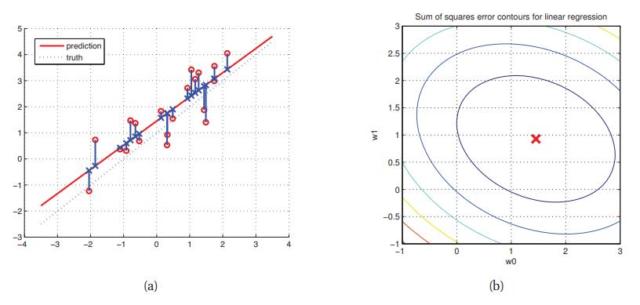
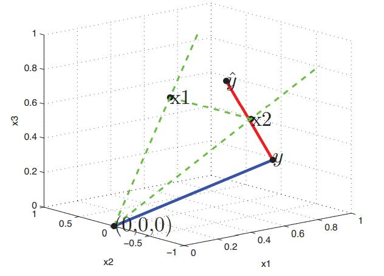
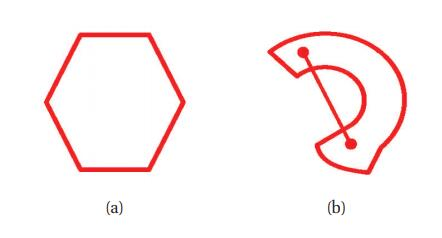
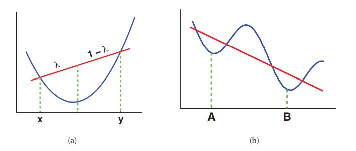

[**返回本章目录**]()

估计统计模型参数的常用方法是计算MLE，其定义为

$$
\hat{\boldsymbol{\theta}} \overset{\Delta}{=} \underset{\boldsymbol{\theta}}{\rm argmax} \log p(\mathcal{D}|\boldsymbol{\theta})  \tag{7.4}
$$

<!--more-->

通常假设训练样本是独立同分布的，通常缩写为**iid**。 这意味着我们可以将对数似然写成：

$$
\ell(\boldsymbol{\theta}) \overset{\Delta}{=} \log p(\mathcal{D}|\boldsymbol{\theta})=\sum_{i=1}^N{\log p(y_i|\boldsymbol{x}_i,\boldsymbol{\theta})}   \tag{7.5}
$$

作为最大化对数似然性的替代, 我们可以使用等价的最小化**负对数似然**或**NLL**：

$$
{\rm NLL}(\boldsymbol{\theta}) \overset{\Delta}{=} - \sum_{i=1}^N{\log p(y_i|\boldsymbol{x}_i,\boldsymbol{\theta})}   \tag{7.6}
$$

NLL公式有时更方便，因为许多优化软件包被设计成寻找函数的最小值，而不是最大值。

现在让我们将MLE方法应用于线性回归。 将高斯的定义插入，我们获得具体的对数似然

$$
\begin{aligned}
\ell(\boldsymbol{\theta}) = &\sum_{i=1}^N{\log \left[\dfrac{1}{\sqrt{2 \pi \sigma^2}} \exp\left(-\dfrac{1}{2\sigma^2}(y_i-\boldsymbol{w}^T\boldsymbol{x}_i)^2\right) \right]}    \\
\quad = & -\dfrac{1}{2\sigma^2} {\rm RSS}(\boldsymbol{w}) - \dfrac{N}{2} \log (2 \pi \sigma^2)   \\
\end{aligned}  \tag{7.7-8}
$$

RSS代表**残差平方和**\(**residual sum of squares**\)，由下式定义

$$
{\rm RSS}(\boldsymbol{w}) \overset{\Delta}{=}\sum_{i=1}^N{(y_i-\boldsymbol{w}^T\boldsymbol{x}_i)^2}   \tag{7.9}
$$

RSS也称为**误差平方和**或**SSE**，${\rm SSE}/N$称为**均方误差**或**MSE**。 可以写成残差向量的$\ell_2$**范数**的平方：

$$
{\rm RSS}(\boldsymbol{w}) = \|\boldsymbol{\epsilon}\|_2^2 = \sum_{i=1}^N{\epsilon_i^2} \tag{7.10}
$$

其中$\epsilon_i =y_i-\boldsymbol{w}^T\boldsymbol{x}_i$ 。

> 图7.2 （a）在线性最小二乘中，我们试图最小化从每个训练点（用红色圆圈表示）到其近似点（用蓝色十字表示）的平方距离之和，也就是说，我们最小化小的垂直蓝线长度之和。 用$\hat{y}(x)= w_0 + w_1 x$表示的红色对角线，就是最小二乘回归线。 注意，与图12.5相比，这些残差线并不垂直于最小二乘线。 由_residualsDemo_生成的图。 （b）同一个例子的RSS误差曲面的等高线。 红十字代表MLE，$\boldsymbol{w} =(1.45,0.93)$。 由contoursSSEdemo生成的图。

注意关于$\boldsymbol{w}$的MLE就是最小化RSS的那个，因此这种方法被称为**最小二乘法**。 该方法如图7.2（a）所示。 训练数据$(x_i,y_i)$显示为红色圆圈，估计值$(x_i,\hat{y}_i)$显示为蓝色十字形，残差$\epsilon_i= y_i-\hat{y}_i$显示为垂直蓝线。 目标是找到合适的参数设置（斜率$w_1$和截距$w_0$），进而使对应的红线满足最小化残差平方和（垂直蓝线的长度）。

在图7.2（b）中，我们绘制了线性回归示例的NLL曲面。 我们看到它是一个具有唯一最小值的二次“碗” （重要的是，即使我们使用基函数展开，例如多项式也是如此，因为NLL对参数$\boldsymbol{w}$而言仍然是线性的，即使它在输入$\boldsymbol{x}$中不是线性的。）

## 7.3.1 MLE的推导

首先，以更容易微分的形式重写目标函数\(译者注: 每一个等号都忽略了不影响最小化的常数或比例项\)：

$$
{\rm NLL}(\boldsymbol{w})=\dfrac{1}{2}(\boldsymbol{y}-\boldsymbol{X}\boldsymbol{w})^T(\boldsymbol{y}-\boldsymbol{X}\boldsymbol{w})=\dfrac{1}{2}\boldsymbol{w}^T(\boldsymbol{X}^T\boldsymbol{X})\boldsymbol{w}-\boldsymbol{w}^T(\boldsymbol{X}^T\boldsymbol{y})     \tag{7.11}
$$

其中

$$
\boldsymbol{X}^T\boldsymbol{X}=\sum_{i=1}^N{\boldsymbol{x}_i \boldsymbol{x}_i^T}=\sum_{i=1}^N{\left(
\begin{matrix}
x_{i,1}^2 & \dots & x_{i,1}x_{i,D} \\
\vdots & \ddots & \vdots \\
x_{D,i}x_{i,1} & \dots & x_{i,D}^2 \\
\end{matrix}
\right)} \tag{7.12}
$$

是方阵求和，并且

$$
\boldsymbol{X}^T\boldsymbol{y} = \sum_{i=1}^N{\boldsymbol{x}_i y_i}   \tag{7.13}
$$

使用公式4.10的结果，我们看到它的梯度由下式给出

$$
\boldsymbol{g}(\boldsymbol{w})=\boldsymbol{X}^T\boldsymbol{X}\boldsymbol{w}-\boldsymbol{X}^T\boldsymbol{y}=\sum_{i=1}^N{\boldsymbol{x}_i (\boldsymbol{w}^T\boldsymbol{x}_i-y_i)}     \tag{7.14}
$$

梯度取零，得到

$$
\boldsymbol{X}^T\boldsymbol{X}\boldsymbol{w}=\boldsymbol{X}^T\boldsymbol{y}     \tag{7.15}
$$

这就是所谓的**正则方程**。 该线性方程组的相应解$\hat{\boldsymbol{w}}$被称为**普通最小二乘**或**OLS**解，由下式给出

$$
\boxed{\hat{\boldsymbol{w}}_{\rm OLS}=(\boldsymbol{X}^T\boldsymbol{X})^{-1}\boldsymbol{X}^T\boldsymbol{y}}    \tag{7.16}
$$

## 7.3.2 几何解释

这个等式具有优雅的几何解释。 我们假设$N> D$，所以我们的样本比特征多。 $\boldsymbol{X}$的列被定义成嵌入在N维中的D维线性子空间。 令第$j$列为$\tilde{\boldsymbol{x}}_j \in \mathbb{R}^N$ （不要与$\boldsymbol{x}_i \in \mathbb{R}^D$混淆，后者代表第$i$个样本）。同样，$\boldsymbol{y}$也是$\mathbb{R}^N$中的向量。 例如，假设我们有$N = 3$个样本，$D = 2$个特征：

$$
\boldsymbol{X}=\left(
\begin{matrix}
1 & 2 \\
1 & -2 \\
1 & 2 \\
\end{matrix}
\right), y=\left(
\begin{matrix}
8.8957 \\
0.6130 \\
1.7761 \\
\end{matrix}
\right) \tag{7.17}
$$

这些向量描述于如图7.3。

> 图7.3 $N = 3$个样本和$D = 2$个特征的最小二乘法图解。 $\tilde{\boldsymbol{x}}_1$和$\tilde{\boldsymbol{x}}_2$是$\mathbb{R}^3$中的向量; 他们一起定义了2维平面。 $\boldsymbol{y}$也是$\mathbb{R}^3$中的矢量，但不位于此2维平面上。 $\boldsymbol{y}$在该平面上的正交投影表示为$\hat{\boldsymbol{y}}$ 。 从$\boldsymbol{y}$到$\hat{\boldsymbol{y}}$的红线是残差，我们想要最小化它的范数。 为了清晰起见，所有向量都已转换为单位范数。 由_leastSquaresProjection_生成的图。

我们需要寻找一个在这D维线性子空间中的向量$\hat{\boldsymbol{y}} \in \mathbb{R}^N$ ，并且尽可能接近$\boldsymbol{y}$，即我们想要找到

$$
\underset{\hat{\boldsymbol{y}} \in {\rm span({\tilde{\boldsymbol{x}}_1,\dots,\tilde{\boldsymbol{x}}_D})}}{\rm argmin} \ \|\boldsymbol{y}-\hat{\boldsymbol{y}}\|_2   \tag{7.18}
$$

由于$\hat{\boldsymbol{y}} \in {\rm span(\boldsymbol{X})}$ ，因此存在一些权重向量$\boldsymbol{w}$ 满足

$$
\hat{\boldsymbol{y}} = w_1 \tilde{\boldsymbol{x}}_1+\dots+w_D \tilde{\boldsymbol{x}}_D=\boldsymbol{X}\boldsymbol{w}  \tag{7.19}
$$

为了最小化残差$\boldsymbol{y}-\hat{\boldsymbol{y}}$的范数，我们希望残差向量与$\boldsymbol{X}$的每一列都正交，即$\tilde{\boldsymbol{x}}_j^T(\boldsymbol{y}-\hat{\boldsymbol{y}})=0, \forall j=1:D$。因此

$$
\tilde{\boldsymbol{x}}_j^T(\boldsymbol{y}-\hat{\boldsymbol{y}})=0 \Rightarrow \boldsymbol{X}^T(\boldsymbol{y}-\boldsymbol{X}\boldsymbol{w})=0 \Rightarrow \boldsymbol{w} = (\boldsymbol{X}^T\boldsymbol{X})^{-1}\boldsymbol{X}^T\boldsymbol{y}   \tag{7.20}
$$

因此， $\boldsymbol{y}$的投影值是

$$
\hat{\boldsymbol{y}} =\boldsymbol{X}\hat{\boldsymbol{w}}= \boldsymbol{X}(\boldsymbol{X}^T\boldsymbol{X})^{-1}\boldsymbol{X}^T\boldsymbol{y} \tag{7.21}
$$

这对应于$\boldsymbol{y}$在$\boldsymbol{X}$的列空间上的**正交投影**。投影矩阵$P\overset{\Delta}{=}\boldsymbol{X}(\boldsymbol{X}^T\boldsymbol{X})^{-1}\boldsymbol{X}^T$被称为**帽子矩阵**\(**hat matrix**\)，因为它“将帽子^放在$\boldsymbol{y}$上”。

## 7.3.3 凸性

在讨论最小二乘时，我们注意到NLL是具有唯一的最小值的碗形。 像这样的函数的技术术语是**凸的**。 凸函数在机器学习中起着非常重要的作用。

让我们更准确地定义这个概念。我们称$\mathcal{S}$集是**凸的**， 如果对于任何$\boldsymbol{\theta},\boldsymbol{\theta}' \in \mathcal{S}$，有

$$
\lambda \boldsymbol{\theta}+(1-\lambda)\boldsymbol{\theta}' \in \mathcal{S}, \forall \lambda \in [0,1]  \tag{7.22}
$$

也就是说，如果我们画一条从$\boldsymbol{\theta}$到$\boldsymbol{\theta}'$的线，那么线上的所有点都在集合内。有关凸集的说明，请参见图7.4（a）;有关非凸集的说明，请参见图7.4（b）。

> 图7.4 （a）凸集的图示。 （b）非凸集的图示。

> 图7.5 （a）凸函数的图示。 我们看到和弦连接$(x,f(x))$ 到$(y,f(y))$ 位于函数之上。 （b）既不凸也不凹的函数。 A是局部最小值，B是全局最小值。 由_convexFnHand_生成的图。

一个函数$f(\boldsymbol{\theta})$ 是凸的，如果其**上境图**（**epigraph**, 函数上方的点集）是凸集。 等价地，一个函数$f(\boldsymbol{\theta})$被称为凸的， 是定义在凸集上，并且对任何$\boldsymbol{\theta},\boldsymbol{\theta}' \in \mathcal{S}$，任何$0 \le \lambda \le 1$，我们有

$$
f(\lambda \boldsymbol{\theta}+(1-\lambda)\boldsymbol{\theta}') \le \lambda f(\boldsymbol{\theta})+(1-\lambda)f(\boldsymbol{\theta}')  \tag{7.23}
$$

参见图7.5的1维的例子。 如果不等式是严格的，则该函数被称为**严格凸**。 如果函数$-f(\boldsymbol{\theta})$ 是凸的，那么函数$f(\boldsymbol{\theta})$ 是凹的。 标量凸函数的例子包括$\theta^2$，$e^\theta$和$\theta \log \theta,\forall \theta>0$。 标量凹函数的例子包括$\log \theta$和$\sqrt{\theta}$。

直观地，（严格地）凸函数具有“碗形”，因此具有对应于碗底部的唯一全局最小$\theta^{\\*}$。 因此它的二阶导数在任何地方都必须是正的$\frac{d^2}{d\theta^2}f(\theta)> 0$ 。 一个二次连续可微多元函数$f$是凸的， 当且仅当，其Hessian矩阵对所有$\boldsymbol{\theta}$都是正定的。在机器学习环境中，函数$f$经常 对应于NLL。

NLL是凸的模型是可取的，因为这意味着我们总能找到全局最优的MLE。 我们将在本书后面看到许多这方面的例子。 然而，许多感兴趣的模型不会有凹的拟然。 在这种情况下，我们将讨论导出局部最优参数估计的方法。

[**返回本章目录**]()

