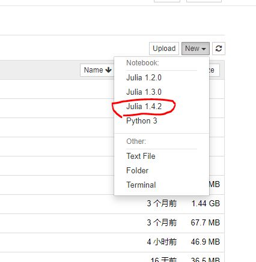

## 目标

１） 统一利用**Visual Studio Code**作为Julia和Python的ＩＤＥ

２） 统一利用**Jupyter**作为Julia和Python的Notebook

３） 以Julia作为我主要的使用语言，确保能调用Python的库包

<!--more-->

## 第一步 安装Anaconda

> 国内建议到[清华开源镜像](https://mirrors.tuna.tsinghua.edu.cn/anaconda/archive/)站根据各自的情况选择下载。
>

1）下载、安装【按提示安装VSCode，如果没有的话】

我选择的是： Anaconda3-5.3.1-Windows-x86_64.exe   建议安装在非系统盘。


2）配置国内镜像，我选择[清华开源镜像](https://mirror.tuna.tsinghua.edu.cn/help/anaconda/)：

* 启动Anaconda命令行，执行下面命令配置镜像：

```text
conda config --add channels https://mirrors.tuna.tsinghua.edu.cn/anaconda/pkgs/free/  
conda config --add channels https://mirrors.tuna.tsinghua.edu.cn/anaconda/pkgs/main/  
conda config --set show_channel_urls yes
```

* 检查镜像设置

```text
conda config --show channels
```

3）安装时VSCode自动配置好了，如果手工安装的VSCode,需要手工搜索安装Anaconda扩展


4）最后用VSCode写一个简单的Hello World程序验证之。


## 第二步 安装Julia

> 国内建议到[北外镜像站](https://mirrors.bfsu.edu.cn/julia-releases/bin/)站根据各自的情况选择下载。

1）Julia的下载、安装、设置环境变量PATH

我选择的是： julia-1.4.2-win64.exe 建议安装在非系统盘。

2） 设置Julia库目录  【注意目录要和实际一致】

```julia
mklink /D /J  %HOMEPATH%\.julia D:\ProgramData\Julia\JuliaDepot
```

3) 设置[北外镜像站](https://mirrors.bfsu.edu.cn/help/julia/)   【要重启julia】

```julia
# %HOMEPATH%\.julia\config\startup.jl
ENV["JULIA_PKG_SERVER"] = "https://mirrors.bfsu.edu.cn/julia/static"
```

4）更新Julia库

```julia
> julia

julia > ]
pkg> update
```

## 第三步 为Julia配置VSCode

1）安装julia扩展插件


2）打开 文件》首选项》设置，设置Julia命令路径【注意红圈标记】


3）写一个简单的Hello world程序，验证配置是否成功。

## 第四步 为Julia配置Jupyter

安装Anaconda时，已经为Python配置过Jupyter了，现在只要补充为Julia配置即可。

1）设置Jupyter路径 【要重启julia】

```julia
# %HOMEPATH%/.julia/config/startup.jl  【注意和实际一致】
ENV["JUPYTER"]="D:\\ProgramData\\Anaconda3\\Scripts\\jupyter.exe"
```

2) 然后安装IJulia

```julia
]
pkg> add IJulia
```

3） 设置jupter的默认目录：

```julia
# 务必在Anaconda命令行中执行
jupyter notebook --generate-config

# 这个命令会生成一个文件：
# %HOMEPATH%/.jupyter/jupyter_notebook_config.py

# 在此文件中找到下行，取消注释，修改目标目录【以实际为准】
# c.NotebookApp.notebook_dir = u'E:\\Work'
```

4) 启动Jupyter Notebook，能看见julia内核就算成功。

```julia
# 在Anaconda命令行中执行

jupyter notebook
```



## 第四步 安装GR库

1）首先当然试图正常安装，如果一切正常，后续步骤忽略

```julia
> julia

julia> ]
pkg> add GR
```

2） 如果报错，或等待时间太长，意味着是网络问题. 并且大概率是卡在build阶段。  那么你务必准备好翻墙软件再继续：


```julia
# 建议在cmd命令行中开始

# 设置代理【以实际为准】
> set http_proxy=http://127.0.0.1:9081
> set https_proxy=http://127.0.0.1:9081

> julia

julia> ]
pkg> build GR

Ctrl+c

julia> exit()

# 清除代理
> set http_proxy=
> set https_proxy=
```


* 验证安装成功否【也可在jupyter notebook中执行】

  ```julia
  using GR
  histogram(randn(10000))
  ```


## 第五步 Julia调用Python库包的基础配置

Ａ．进入Julia命令行，首先设置Python的路径 【要重启julia】

```julia
# vim ~/.julia/config/startup.jl  【注意和实际一致】
ENV["PYTHON"] = "D:\\ProgramData\\Anaconda3\\python.exe"
```

Ｂ．安装调用Python的基础库

```julia
]
pkg> add PyCall
```

Ｃ．以SymPy作为范例，先安装范例需要的Python库，然后执行相应的代码

```julia
]
pkg> add SymPy　# 安装Python库的对应接口库

using SymPy

@vars x h # 定义符号变量
limit((sin(x+h)-sin(x))/h,h,0) # 求极限
diff(sin(x)) # 求导
```


## 大功告成

------------------------

> 后面的内容是额外补充的

------------------------

## 第六步 改用Jupyter Lab 【“淘汰掉”Juppter Notebook】

【Juppter Notebook的配置全部保留】

安装Jupyter Lab：

```julia
# 在Anaconda命令行中执行

conda install -c conda-forge jupyterlab
```

启动Jupyter Lab 

```julia
# 在Anaconda命令行中执行

jupyter lab
```

启动后的效果：


## 第七步 整合WolframScript

> 假设1)你已经安装了Wolfram Mathematica 或 免费的WolframEngine，都有WolframScript，并设置好PATH环境变量; 
>
> 假设2）你已经安装配置好了Git，并设置好PATH环境变量

参考 [WolframLanguageForJupyter](https://github.com/WolframResearch/WolframLanguageForJupyter)


```julia
# 务必在Anaconda命令行中执行【要和jupyter整合】

git clone https://github.com/WolframResearch/WolframLanguageForJupyter.git

cd WolframLanguageForJupyter

.\configure-jupyter.wls add
```

重启Jupyter Lab， 就可以看见前面那张图中的`Wolfram Lanquaqe`的图标。


