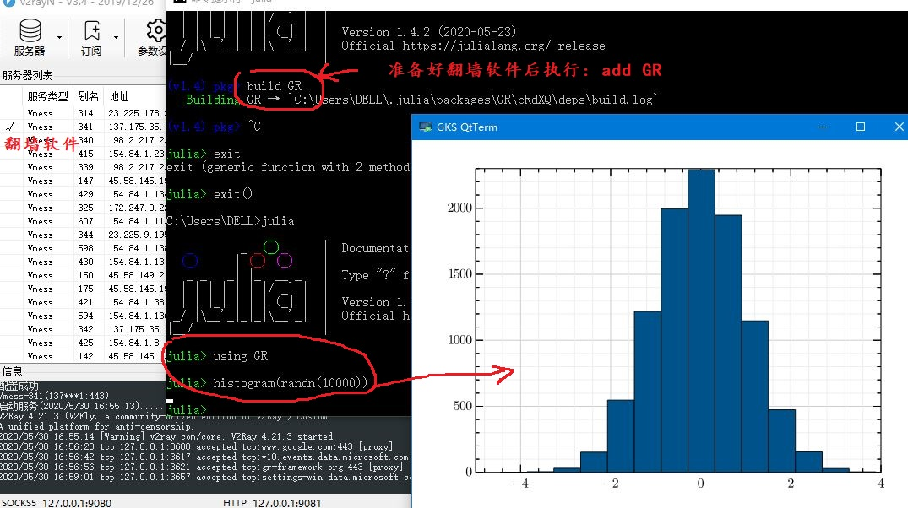
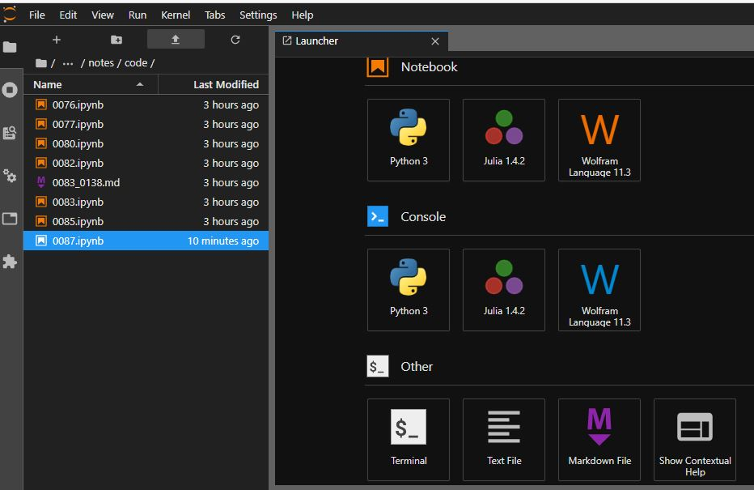
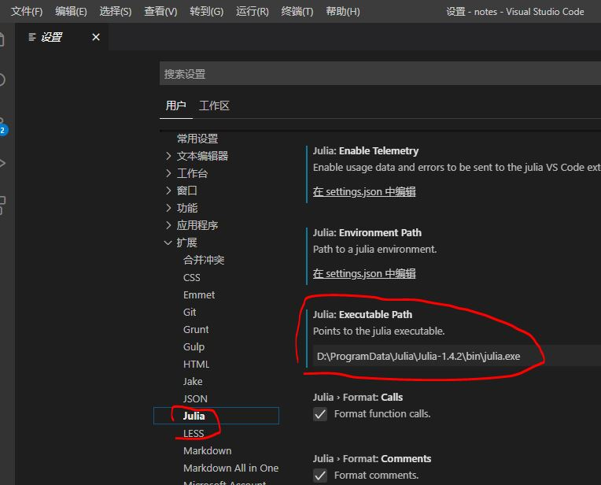

## 目标

１） 统一利用**Visual Studio Code**作为Julia和Python的ＩＤＥ

２） 统一利用**Jupyter**作为Julia和Python的Notebook

３） 以Julia作为我主要的使用语言，确保能调用Python的库包

4）Shell部分在Ubuntu中安装，IDE依然在Windows上。

<!--more-->

## 第一步 安装WSL&Ubuntu

1）首先，安装[PowerShell 7](https://github.com/PowerShell/PowerShell/releases/tag/v7.0.0)。

2）然后，安装`WSL`：用**管理员权限**打开`PowerShell7`，执行如下命令行（打开linux子系统功能）【也可以在windows功能面板里打开】

```powershell
PS C:\Users\DELL> Enable-WindowsOptionalFeature -Online -FeatureName Microsoft-Windows-Subsystem-Linux
```

3）然后，进入Windows商店，选择安装`Ubuntu`：


4）将安装文件迁移到非系统盘，比如 `D:\Ubuntu`。找到安装目录（并记下这个目录名），比如（如图）：`C:\Users\DELL\AppData\Local\Packages\CanonicalGroupLimited.UbuntuonWindows_79rhkp1fndgsc`。然后卸载Ubuntu后，  用`mklink`建立符号链接，之后在安装Ubuntu即可。



5）修改Ubuntu源，我选择[Ubuntu阿里源](https://developer.aliyun.com/mirror/ubuntu?spm=a2c6h.13651102.0.0.3e221b115YxiP0)。

## 第二步 Win10安装VSCode

安装[VSCode](https://code.visualstudio.com/)，然后安装`WSL`插件：



选择，WSL终端， Ctrl+` ，选择“默认Shell”，然后选择WSL：


尝试在WSL终端执行几个Ubuntu命令看看效果。

## 第三步 安装Anaconda

> 国内建议到[清华开源镜像](https://mirrors.tuna.tsinghua.edu.cn/anaconda/archive/)站根据各自的情况选择下载。
>

1）启动Ubuntu、下载、安装【不需要安装VSCode】

```
wget https://mirrors.tuna.tsinghua.edu.cn/anaconda/archive/Anaconda3-5.3.1-Linux-x86_64.sh

Bash Anaconda3-5.3.1-Linux-x86_64.sh
```

【注意】安装过程中，**不要安装**_Visual Studio Code_。

2）配置国内镜像，我选择[清华开源镜像](https://mirror.tuna.tsinghua.edu.cn/help/anaconda/)：

* 配置镜像：

```text
conda config --add channels https://mirrors.tuna.tsinghua.edu.cn/anaconda/pkgs/free/  
conda config --add channels https://mirrors.tuna.tsinghua.edu.cn/anaconda/pkgs/main/  
conda config --set show_channel_urls yes
```

* 检查镜像设置

```text
conda config --show channels
```

3）创建一个项目HelloWorld，用VSCode打开：

```
mkdir HelloWorld
cd HelloWorld
code .
```

【注意】第一次执行`code .`时，会自动提示安装VSCode服务。 

`code .`执行后，会自动打开VSCode:


后面的工作就可以在VSCode中继续。

## 第四步 安装Julia

> 国内建议到[北外镜像站](https://mirrors.bfsu.edu.cn/help/julia/)站根据各自的情况选择下载。

1）Julia的下载、安装（解压）、设置环境变量

```
wget https://mirrors.bfsu.edu.cn/julia-releases/bin/linux/x86/1.4/julia-1.4.1-linux-i686.tar.gz

tar -zxvf julia-1.4.1-linux-i686.tar.gz

# vim ~/.bashrc  【设置范例】
# export PATH=$PATH:/home/chaoskey/julia-1.4.1/bin
```

2） 设置Julia库目录   【要重启julia】

```text
# vim ~/.julia/config/startup.jl   【注意和实际一致】
ENV["JULIA_DEPOT_PATH"] = "/mnt/e/Work/dotJulia"
```

3) 设置[北外镜像站](https://mirrors.bfsu.edu.cn/help/julia/)   【要重启julia】

```julia
# ~/.julia/config/startup.jl
ENV["JULIA_PKG_SERVER"] = "https://mirrors.bfsu.edu.cn/julia/static"
```

4）更新Julia库

```julia
julia
]
pkg> update
```

## 第五步 为Julia配置VSCode

1）在Ubuntu中创建一个项目HelloWorld，在其中执行`code .`， 也会自动打开VSCode。【和第三步末尾类似，略】

2）安装julia扩展插件


3）打开 文件》首选项》设置，设置Julia命令路径【注意红圈标记】




4）写一个简单的Hello world程序，验证配置是否成功。

## 第六步 为Julia配置Jupyter

1）设置Jupyter路径 【要重启julia】

```julia
# vim ~/.julia/config/startup.jl  【注意和实际一致】
ENV["JUPYTER"]="/home/chaoskey/anaconda3/bin/jupyter"
```

2) 然后安装IJulia

```julia
]
pkg> add IJulia
```

3) 启动Jupyter Notebook，能看见julia内核就算成功。


## 第七步 安装Julia必要的库

1）由于GR很难安装成功，所以这里特别讲一下

* 首先试图安装，如果安装正常，忽略后续

```julia
]
pkg> add GR
```

* 如果安装不正常，或时间太长，建议到[GR官网](https://gr-framework.org/downloads/)下载合适的版本，我下载的是gr-0.49.0-Ubuntu-x86_64.tar.gz。最后解压得到目录gr， 然后覆盖JULIA\_DEPOT\_PATH/packages/GR/cRdXQ/deps/中的同名目录gr。 【注意：JULIA\_DEPOT\_PATH和cRdXQ以实际目录为准】
* 验证安装成功否【可在jupyter notebook中执行】

  ```julia
  using GR
  histogram(randn(10000))
  ```


## 第八步 Julia调用Python库包的基础配置

Ａ．进入Julia命令行，首先设置Python的路径 【要重启julia】

```julia
# vim ~/.julia/config/startup.jl  【注意和实际一致】
ENV["PYTHON"] = "/home/chaoskey/anaconda3/bin/python"
```

Ｂ．安装调用Python的基础库

```julia
]
pkg> add Pycall
```

Ｃ．以SymPy作为范例，先安装范例需要的Python库，然后执行相应的代码

```julia
]
pkg> add SymPy　# 安装Python库的对应接口库

using SymPy

@vars x h # 定义符号变量
limit((sin(x+h)-sin(x))/h,h,0) # 求极限
diff(sin(x)) # 求导
```


## 大功告成


