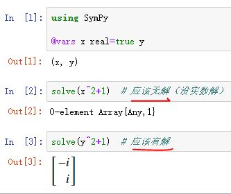
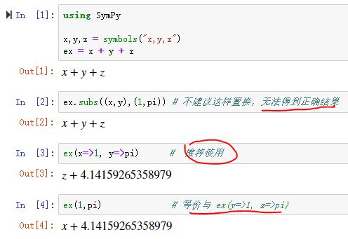
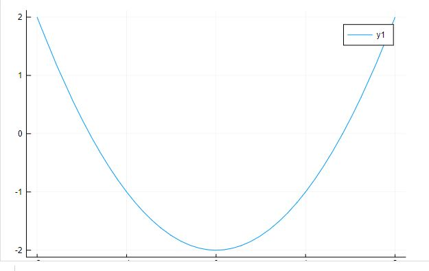
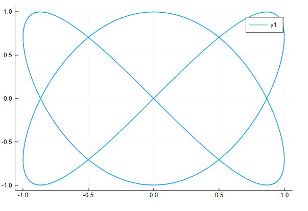
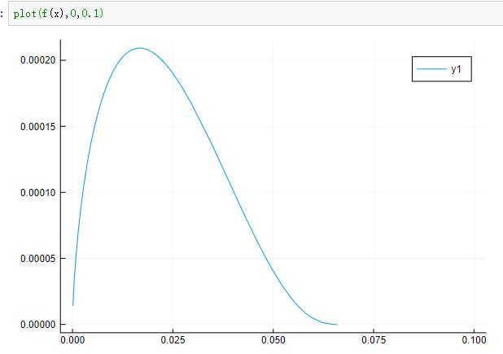
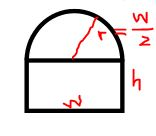

## 前言

在[整合Julia和Python的集成环境](https://joistwang.gitbook.io/notes/self/0001)中已经配置好环境，可以在**Jupyter**中进行学习研究了。

由于Julia本身暂时还没有好用的符号演算库，只好借用Python的SymPy库。所以，标题应该是“Julia和Python中的数学符号演算”，但由于本文都在Julia环境下进行，单独说Julia将就也可以。

<!--more-->

安装SymPy:

```julia
]
pkg> add SymPy　# 安装SymPy的对应接口库
```

本文的内容主要来自，[SymPy.jl教程](https://github.com/JuliaPy/SymPy.jl/blob/master/examples/tutorial.md) 和 [SymPy官方教程](https://docs.sympy.org/1.5.1/tutorial/index.html)。

模块导入:

```julia
using SymPy
```


## 变量符号

```julia
@vars x y z                # 无假设变量定义１

a,b,c = Sym("a,b,c")       # 无假设变量定义２
```

## 带假设的变量符号

```julia
u = symbols("u")            # 无假设变量定义３

t = symbols("t", real=true) # 带假设变量定义
y1, y2 = symbols("y1, y2", positive=true)
alpha = symbols("alpha", integer=true, positive=true)

@vars u1 u2 positive=true   # @vars也能定义带假设变量
```

比如：

```julia
using SymPy

@vars x real=true y

solve(x^2+1)  # 应该无解（没实数解）

solve(y^2+1)  # 应该有解
```



## SymPy中的特殊常数

```julia
PI, oo
```

依次代表SymPy中的**符号圆周率**，**符号无穷大**。 务必注意和julia中的pi和$$\infty$$区分。

## 符号置换

单变量置换：

```julia
@vars x y
ex = x^2 + 2x + 1
ex.subs(x, y)   # 结果是y^2 + 2x +1
```

多变量置换

```julia
@vars x y z
ex = x + y + z

ex.subs((x,y),(1,pi)) # 不建议这样置换，无法得到正确结果
ex(x=>1, y=>pi)       #  推荐使用
ex(1,pi)  　　　　　　  # 等价与 ex(y=>1, z=>pi)
```



## 符号转换成数值

以圆周率为范例展示（注意：后面有是符号还是数值的注释）：

```julia
PI              # 符号圆周率, 符号
N(PI)           # 转换成无理数圆周率，数值
PI.evalf()　    # 转换成默认个有效位数的圆周率，还是符号
PI.evalf(30)　  # 转换成30个有效位数的圆周率，还是符号
N(PI.evalf(30)) # 最后转换成有理数，数值
```


## 多项式常用操作

### 1 展开

```julia
@vars x

expr = expand(prod((x-i) for i in 1:5))
```

结果是：$$x^5−15x^4+85x^3−225x^2+274x−120$$

### 2 因式分解

```julia
factor(expr)
```

结果是：$$(x−5)(x−4)(x−3)(x−2)(x−1)$$

非规则多项式，有时也能因式分解：

```julia
factor(exp(2x) + 3exp(x) + 2)
```

结果是：$$(e^x+1)(e^x+2)$$

### 3 合并同类项

```julia
@vars x y q

q = x*y + x*y^2 + x^2*y + x

collect(q, x)
```

结果是：　$$x^2y+x(y^2+y+1)$$

```julia
collect(q, y)
```

结果是：$$xy^2+x+y(x^2+x)$$

### 4 化简

```julia
simplify(q)
```

结果是：$$x(xy+y^2+y+1)$$

有时，展开操作也能起到化简的作用，可酌情先试试：

```julia
expand((x + 1)*(x - 2) - (x - 1)*x)
```

结果是: -2

## 有理式常用操作

### 1 分部

```julia
apart( (4x^3 + 21x^2 + 10x + 12) /  (x^4 + 5x^3 + 5x^2 + 4x))
```

结果是：$$\dfrac{2x−1}{x^2+x+1}−\dfrac{1}{x+4}+\dfrac{3}{x}$$

### 2 合并公母

```julia
together(1/x + 1/x^2)
```

结果是：$$\dfrac{1}{x^2}(x+1)$$

### 3 消去分子分母公因子

```julia
cancel((x^3-6x^2+11x-6)/(x^2-5x+4))
```

结果是：$$\dfrac{x^2−5x+6}{x−4}$$

原式本质是：$$\dfrac{(x-1)(x-2)(x-3)}{(x-1)(x-4)}$$

## 指数化简

可以对含指数的表达式进行无条件或有条件的化简。背后实际是调用powsimp

有条件化简：

```julia
@vars x y nonnegative=true a real=true
simplify(x^a * y^a - (x*y)^a)
```

结果是：0

无条件化简：

```julia
@vars x y a
simplify(x^a * y^a - (x*y)^a)
```

结果是：$$x^ay^a−(xy)^a$$

## 三角化简

三角表达式的化简，背后实际是调用trigsimp，当然我们可以不关心。

```julia
@vars θ real=true

simplify(cos(θ)^2 + sin(θ)^2)
simplify(sin(2θ) - 2sin(θ)*cos(θ))
```

结果分别是： 1, 0

## 多项式系数

提取多项式系数

```julia
@vars a b c x
p = a*x^2 + b*x + c

p.coeff(x^2)  # a
p.coeff(x)    # b
p(x=>0)       # c
```

注意：SymPy原生有函数coeffs()来获取所有系数，但在Julia中执行会失败。但有两种变通的方法可以使用。

```julia
# p.coeffs() # SymPy原生有这个函数，但在Julia中执行会失败

# 变通的方法
Sym[[p.coeff(x^i) for i in N(degree(p,gen=x)):-1:1]; p(x=>0)]  

# 通过sympy构造对应的q, 这样才能调用SymPy原生的coeffs
q = sympy.Poly(p, x)
q.coeffs()
```

## 多项式的根

### 1 实数根

```julia
real_roots(x^2 - 2)
real_roots((x-3)^2*(x-2)*(x-1)*x*(x+1)*(x^2 + x + 1))
```

结果分别是： $$\left[ \begin{array}{r}- \sqrt{2}\\ \sqrt{2}\end{array} \right]$$　和　$$\left[ \begin{array}{r}-1\\0\\1\\2\\3\\3\end{array} \right]$$

### 2 复数根

```julia
Sym(roots(a*x^2 + b*x + c,x))

Sym(roots((x-3)^2*(x-2)*(x-1)*x*(x+1)*(x^2 + x + 1)))

# 对应的数值根
# nroots((x-3)^2*(x-2)*(x-1)*x*(x+1)*(x^2 + x + 1)) 
```

结果分别是：　 $$\left \{ - \frac{b}{2 a} - \frac{1}{2 a} \sqrt{- 4 a c + b^{2}} : 1, \quad - \frac{b}{2 a} + \frac{1}{2 a} \sqrt{- 4 a c + b^{2}} : 1\right \}$$　和　$$\left \{ -1 : 1, \quad 0 : 1, \quad 1 : 1, \quad 2 : 1, \quad 3 : 2, \quad - \frac{1}{2} - \frac{\sqrt{3} i}{2} : 1, \quad - \frac{1}{2} + \frac{\sqrt{3} i}{2} : 1\right \}$$

### 3 更通用的求解方法

```julia
rts = solve((x-3)^2*(x-2)*(x-1)*x*(x+1)*(x^2 + x + 1))

# 可求得数值
# N.(rts)
```

结果是： $$\left[ \begin{array}{r}-1\\0\\1\\2\\3\\- \frac{1}{2} - \frac{\sqrt{3} i}{2}\\- \frac{1}{2} + \frac{\sqrt{3} i}{2}\end{array} \right]$$

## solve函数

除了仅查找单变量多项式的根以外，solve函数还具有更广泛的用途。该函数尝试求解表达式为0或一组表达式都为0的情况。

```julia
solve(cos(x) - sin(x))     # 返回一个确定范围内的解
solveset(cos(x) - sin(x))  # 返回一个解集合
```

结果分别是： $$\left[ \begin{array}{r}- \frac{3 \pi}{4}\\ \frac{\pi}{4}\end{array} \right]$$ 和 $$\left\{2 n \pi + \frac{5 \pi}{4}\; |\; n \in \mathbb{Z}\right\} \cup \left\{2 n \pi + \frac{\pi}{4}\; |\; n \in \mathbb{Z}\right\}$$

其中，solveset得到的是一个集合，对有限解集而言，可用collect来收集解，但需要先转换成Julia集，再收集：

```julia
v = solveset(x^2 - 4)

collect(Set(v...)) # 先转换成Julia集，再收集

elements(v) # 也可以直接获得
```

第二个表达式的结果是： $$\left[ \begin{array}{r}-2\\2\end{array} \right]$$

需要注意的是，SymPy中的solve是有局限性的，如果没有形式解，将会报错：

```julia
solve(cos(x) - x)  # 没有形式解，会报错
```

此时，只能求对应的数值解：

```julia
nsolve(cos(x) - x, 1)
```

结果是：0.7390851332151606416553120876738734040134117589007574649656806357732846548836

尽管不是什么都是能求解，但可能的话，能够给出一般形式的解，比如：

```julia
@vars a b c real=true
p = a*x^2 + b*x + c

solve(p, x)
solveset(p, x)
```

结果分别是： $$\left[ \begin{array}{r}\frac{1}{2 a} \left(- b + \sqrt{- 4 a c + b^{2}}\right)\\- \frac{1}{2 a} \left(b + \sqrt{- 4 a c + b^{2}}\right)\end{array} \right]$$　和 $$\left\{- \frac{b}{2 a} - \frac{1}{2 a} \sqrt{- 4 a c + b^{2}}, - \frac{b}{2 a} + \frac{1}{2 a} \sqrt{- 4 a c + b^{2}}\right\}$$

还可以求解方程组：

```julia
@vars x y real=true
exs = [2x+3y-6, 3x-4y-12]
d = solve(exs)
Sym(d)
```

结果是： $$\left \{ x : \frac{60}{17}, \quad y : - \frac{6}{17}\right \}$$

将这个结果代入原方程，看是否每个表达式都为０：

```julia
map(ex -> ex.subs(d), exs)
```

ＯＫ，结果的确都为０：　 $$\left[ \begin{array}{r}0\\0\end{array} \right]$$

我们也可以选定求解变量：

```julia
@vars a b c h real=true
p = a*x^2 + b*x + c
fn = cos
exs = [fn(0*h)-p(x=>0), fn(h)-p(x => h), fn(2h)-p(x => 2h)]
d = solve(exs, [a,b,c]) # 选定a,b,c为待求解变量
Sym(d)
```

结果是： $$\left \{ a : \frac{1}{2 h^{2}} \left(- 2 \cos{\left (h \right )} + \cos{\left (2 h \right )} + 1\right), \quad b : \frac{1}{2 h} \left(4 \cos{\left (h \right )} - \cos{\left (2 h \right )} - 3\right), \quad c : 1\right \}$$

将结果d代入p表达式:

```julia
quad_approx = p.subs(d)
```

得到：$$1 + \frac{x}{2 h} \left(4 \cos{\left (h \right )} - \cos{\left (2 h \right )} - 3\right) + \frac{x^{2}}{2 h^{2}} \left(- 2 \cos{\left (h \right )} + \cos{\left (2 h \right )} + 1\right)$$

最后我们再求解一个方程：

```julia
n = 3
@vars x c
as = Sym["a$i" for i in 0:(n-1)]
bs = Sym["b$i" for i in 0:(n-1)]
p = sum([as[i+1]*x^i for i in 0:(n-1)])
q = sum([bs[i+1]*(x-c)^i for i in 0:(n-1)])
d = solve(p-q, bs)
Sym(d)
```

结果是： $$\left \{ b_{0} : a_{0} + a_{1} c + a_{2} c^{2}, \quad b_{1} : a_{1} + 2 a_{2} c, \quad b_{2} : a_{2}\right \}$$

## solve中的逻辑操作

前面的solve中，没必须将表达式写成ex=0，但对更复杂的方程，还是需要逻辑操作的。

在SymPy中，定义了各种逻辑操作：Eq, Lt, Le, Ge, Gt。　在Julia中则可用符号替代：`\ll[tab]`($$\ll$$), `\leqq[tab]`($$\leqq$$), `\Equal[tab]`($$==$$), `\geqq[tab]`($$\geqq$$), `\gg[tab]`($$\gg$$) , `\neg[tab]`($$\neg$$)。

比如：

```julia
@vars x y real=true
exs = [2x+3y ⩵ 6, 3x-4y ⩵ 12]    ## Using \Equal[tab]
d = solve(exs)
Sym(d)
```

结果是： $$\left \{ x : \frac{60}{17}, \quad y : - \frac{6}{17}\right \}$$

## 绘图

Plots库可以直接绘制处于符号状态的表达式，比如：

```julia
using Plots

@vars x

plot(x^2 - 2, -2,2)
```



再比如参数绘制：

```julia
plot(sin(2x), cos(3x), 0, 4pi)
```



## 微积分

### 1 极限

比如计算$$\lim\limits_{x \to +\infty}{\dfrac{\sin(x)}{x}}=1$$，有两种写法：

```julia
@vars x

limit(sin(x)/x, x, 0) # 写法１：3个参数
limit(sin(x)/x, x=>0) # 写法２：2个参数, 我喜欢这种
```

至于$$\infty$$，可以写成两个o来表示，即`oo`：

```julia
limit((1+1/x)^x, x => oo)　# 结果是　e
```

即：$$\lim\limits_{x \to \infty}{(1+\dfrac{1}{x})^x}=e$$

再比如：

```julia
@vars a positive=true

ex = (sqrt(2a^3*x-x^4) - a*(a^2*x)^(1//3)) / (a - (a*x^3)^(1//4))

ex(x=>a)          # 返回NaN，错误
denom(ex)(x => a), numer(ex)(x => a)# 返回(0,0),找到原因
limit(ex, x => a) # 返回16a/9,正确
```


#### 左、右极限

对于左右极限，可用表示方向的可选参数`dir="-"`, `dir="+"`,比如：

```julia
limit(sign(x), x => 0, dir="-"), limit(sign(x), x => 0, dir="+")  # 结果是：　(-1,1)
```

#### 数值的局限性

我现在考虑一个特别的函数$$f(x)=x^{- \log{\left (\log{\left (\log{\left (\log{\left (\frac{1}{x} \right )} \right )} \right )} \right )} + 1}$$,很明显这个函数的定义域是：$$(0,\infty)$$

```julia
f(x) = 1/x^(log(log(log(log(1/x)))) - 1)

plot(f(x),0,0.1) # 绘图展示此函数的形态
```



从此图看，我们会感觉到，向左趋向0的极限，趋向$$\infty$$的极限都应该是０。但实际情况是：

```julia
limit(f(x), x => 0, dir="＋"), limit(f(x), x => oo)
```

返回的结果是：(oo, 0)。

这个例子说明了`数值的局限性`。`limit`函数使用了Gruntz算法，它比简单的极限数值尝试可靠得多。

### 2 导数

我们自然可以根据导数的定义用极限进行求导：

```julia
@vars x h
f(x) = exp(x)*sin(x)
limit((f(x+h) - f(x)) / h, h, 0)
```

返回结果是：$$e^{x} \sin{\left (x \right )} + e^{x} \cos{\left (x \right )}$$

关于求导，推荐的方法还是使用`diff`函数：

```julia
diff(f(x))  　　# 对默认符号变量x求导
diff(f(x),x)   # 对指定符号变量x求导, 【推荐】
```

返回结果：$$e^{x} \sin{\left (x \right )} + e^{x} \cos{\left (x \right )}$$

二阶导数（n阶导数类推），比如：

```julia
diff(exp(-x^2), x, 2) # 用２表示二阶导数，【推荐】
diff(exp(-x^2), x, x) # 用两个x表示二阶导数
```

返回结果：$$2 \left(2 x^{2} - 1\right) e^{- x^{2}}$$

我们经常要求解微分后等于０的方程，可以用`diff`和`solve`通过`|>`进行组合来实现：

```julia
f(x) = (12x^2 - 1) / (x^3)
diff(f(x), x) |> solve
```

返回的结果是： $$\left[ \begin{array}{r}- \frac{1}{2}\\ \frac{1}{2}\end{array} \right]$$

#### 偏导数

`diff`也可用来求偏导数，比如：

```julia
@vars x y
ex = x^2*cos(y)
Sym[diff(ex,v1, v2) for v1 in [x,y], v2 in [x,y]]
```

返回的结果： $$\left[ \begin{array}{rr}2 \cos{\left (y \right )}&- 2 x \sin{\left (y \right )}\\- 2 x \sin{\left (y \right )}&- x^{2} \cos{\left (y \right )}\end{array}\right]$$

#### 形式求导

所谓`形式求导`，就是给出求导形式，但暂时不计算出求导结果。比如：

```julia
ex = sympy.Derivative(exp(x*y), x, y, 2)
```

返回的结果是：$$\frac{\partial^{3}}{\partial x\partial y^{2}}  e^{x y}$$。　　　

这个函数julia中没有，需要通过sympy调用。

当然，这个形式求导可以在需要的时候将求导结果计算出来：

```julia
ex.doit()
```

返回的结果是：$$x \left(x y + 2\right) e^{x y}$$

#### 隐式求导

所谓`隐式求导`，就是给出多个变量之间的方程关系，求其中一个变量相对其它变量的导数。也就是对`隐函数求导`。 比如：

```julia
@vars x y                   # 定义变量
F, G = SymFunction("F,G")   # 定义隐函数

ex = y^4 - x^4 - y^2 + 2x^2 # 关系ex=0
ex1 = ex(y=>F(x))           # 将隐函数代入
ex2 = diff(ex1, x)          # 求导
ex3 = solve(ex2, F'(x))[1]  # 求隐函数导数的形式解
ex4 = ex3(F(x) => y)        # 隐函数复原后，就是隐式求导结果
[ex⩵0,ex1⩵0,ex2⩵0,F'(x)⩵ex3,F'(x)⩵ex4]
```

计算过程：

$$
\left. \begin{array}{r}- x^{4} + 2 x^{2} + y^{4} - y^{2} = 0\\- x^{4} + 2 x^{2} + F^{4}{\left (x \right )} - F^{2}{\left (x \right )} = 0\\- 4 x^{3} + 4 x + 4 F^{3}{\left (x \right )} \frac{d}{d x} F{\left (x \right )} - 2 F{\left (x \right )} \frac{d}{d x} F{\left (x \right )} = 0\\ \frac{d}{d x} F{\left (x \right )} = \frac{2 x \left(x^{2} - 1\right)}{\left(2 F^{2}{\left (x \right )} - 1\right) F{\left (x \right )}}\\ \frac{d}{d x} F{\left (x \right )} = \frac{2 x \left(x^{2} - 1\right)}{y \left(2 y^{2} - 1\right)}\end{array} \right.
$$


#### 范例：最大化诺尔曼窗口的面积

如下图（诺尔曼窗口），周长固定的前提下，求诺尔曼窗口面积最大的宽高。



```julia
@vars w h P nonnegative=true # 宽w,高h, 周长P（固定）
r = w/2                      # 半圆的半径r
A = w*h + 1//2 * (pi * r^2)  # 诺尔曼窗口面积
p = w + 2h + pi*r            # 周长
```

求解目标：A最大化。

首先根据周长固定的约束条件，消除变量h，保留一个变量w：

```julia
h0 =  solve(P-p, h)[1]
A1 = A(h => h0)
```

得到关于w的面积公式：$$\frac{\pi w^{2}}{8} + w \left(\frac{P}{2} - \frac{\pi w}{4} - \frac{w}{2}\right)$$

要使这个面积最大，除了极值外，还需要考虑$$w=0$$和$$h=0$$这两个端点的情况：

```julia
A1(w => 0)                     # 宽０,则面积０,不是目标解
b = solve((P-p)(h => 0), w)[1] # 高０时所对应的宽
```

下面求面积极值所对应的宽：

```julia
c = solve(diff(A1, w), w)[1]
```

比较宽分别为b,c时，谁面积更大，面积更大者为问题解：

```julia
simplify(A1(w => c)-A1(w => b))
```

返回的结果是正值：$$\frac{2 P^{2}}{16 + \pi^{3} + 20 \pi + 8 \pi^{2}}$$

这个结果说明，当宽度为c时，面积最大。 对应的宽度，高度，面积分别是：

```julia
simplify.([c,h0(w=>c),A1(w=>c)])
```

结果是：

$$
\left[ \begin{array}{r}\frac{2 P}{\pi + 4}\\ \frac{P}{\pi + 4}\\ \frac{P^{2}}{2 \left(\pi + 4\right)}\end{array} \right]
$$

这个结果表明：宽是高的２倍为此问题的最优解。

### 3 积分

首先来一个不定积分：

```julia
@vars x n real=true

ex = integrate(x^n, x)  # 不定积分的参数和diff基本一致
```

返回结果： $$\begin{cases} \log{\left (x \right )} & \text{for}\: n = -1 \\ \frac{x^{n + 1}}{n + 1} & \text{otherwise} \end{cases}$$

至于定积分，只需要将变量扩展成变量区间即可：

```julia
integrate(x^2, (x, 0, 1)) # 将不定积分x换成形如(x,0,1)
```

结果是：$$\dfrac{1}{3}$$

#### 多重积分

多重积分，主要将一个变量元组换成多个变量元组即可，比如：

```julia
@vars x y
integrate(x*y, (y, 0, 1), (x, 0, 1)) # 这里有两个变量元组
```

再比如：

```julia
# 内层积分的变量的上下限可以依赖外层积分的变量
integrate(x^2*y, (y, 0, sqrt(1 - x^2)), (x, -1, 1))
```

#### 形式积分

`形式积分`　和　`形式求导`对应，比如：

```julia
integ = sympy.Integral(sin(x^2), x)
[integ,integ.doit()]
```

结果是： $$\left[ \begin{array}{r}\int \sin{\left (x^{2} \right )}\, dx\\ \frac{3 \sqrt{2} \sqrt{\pi} S\left(\frac{\sqrt{2} x}{\sqrt{\pi}}\right)}{8 \Gamma{\left(\frac{7}{4} \right)}} \Gamma{\left(\frac{3}{4} \right)}\end{array} \right]$$

### 4 泰勒级数

比如，求关于x，在０点附近，４阶的泰勒级数展开：

```julia
@vars x
s1 = series(exp(sin(x)), x, 0, 4)
```

结果是：$$1 + x + \frac{x^{2}}{2} + \mathcal{O}\left(x^{4}\right)$$

将两个泰勒级数展开式相乘：

```julia
s2 = series(cos(exp(x)), x, 0, 6)
s3 = simplify(s1 * s2)　　#　相乘后再化简
```

结果是：$$\cos{\left (1 \right )} + \sqrt{2} x \cos{\left (\frac{\pi}{4} + 1 \right )} - \frac{3 x^{2}}{2} \sin{\left (1 \right )} - \sqrt{2} x^{3} \sin{\left (\frac{\pi}{4} + 1 \right )} + \mathcal{O}\left(x^{4}\right)$$

去除高阶项：

```julia
s3.removeO()
```

结果是：$$- \sqrt{2} x^{3} \sin{\left (\frac{\pi}{4} + 1 \right )} - \frac{3 x^{2}}{2} \sin{\left (1 \right )} + \sqrt{2} x \cos{\left (\frac{\pi}{4} + 1 \right )} + \cos{\left (1 \right )}$$

## 求和

比如计算$$\sum\limits_{i=1}^n{i^2}$$的结果：

```julia
@vars i n
summation(i^2, (i, 1, n))
```

结果是：$$\frac{n^{3}}{3} + \frac{n^{2}}{2} + \frac{n}{6}$$

自然也可以进行形式求和：

```julia
sn = sympy.Sum(1/i^2, (i, 1, n))
```

结果是：$$\sum\limits_{i=1}^{n} \frac{1}{i^{2}}$$

关于无穷项求和，有两种方法：

```julia
limit(sn.doit(), n, oo)      # 先求和，再取极限
summation(1/i^2, (i, 1, oo)) # 直接求和，【推荐】
```

结果是：$$\dfrac{\pi^{2}}{6}$$

## 向量值函数

在Julia中构造一个符号向量很容易：

```julia
@vars x y

v = [1,2,x]
w = [1,y,3]
```

更一般的向量操作定义在`LinearAlgebra`中：

```julia
using LinearAlgebra

dot(v,w)
cross(v,w)
```

通过组合操作可以根据定义计算`梯度`（`多元一阶导数向量`），比如：

```julia
ex = x^2*y - x*y^2
Sym[diff(ex,var) for var in (x,y)]
```

结果是： $$\left[ \begin{array}{r}2 x y - y^{2}\\x^{2} - 2 x y\end{array} \right]$$

还可以利用`hessian`计算`多元二阶导数矩阵`(`海森矩阵`)：

```julia
hessian(ex, (x,y))
```

结果是： $$\left[ \begin{array}{rr}2 y&2 x - 2 y\\2 x - 2 y&- 2 x\end{array}\right]$$

## 矩阵

在Julia中，符号矩阵的构造和符号向量的构造一样容易：

```julia
@vars x y

M = [1 x; x 1]
```

如果计算的结果是矩阵，但不是Julia型矩阵，不妨依次试试`Sym[.]`和`sympy.Matrix(.)`，比如：

```julia
M^2                # 形式难看
Sym(M^2)           # 依然难看
sympy.Matrix(M^2)　#  嗯，合适
```

结果是： $$\left[ \begin{array}{rr}x^{2} + 1&2 x\\2 x&x^{2} + 1\end{array}\right]$$

计算矩阵行列式：

```julia
det(M)   # 方法１，【推荐】
M.det()  # 方法２
```

结果：$$- x^{2} + 1$$

计算特征向量：

```julia
# A.eigenvects() 有问题
eigvecs(M)
```

结果： $$\left[ \begin{array}{rr}-1&1\\1&1\end{array}\right]$$

矩阵对角化：

```julia
A = [1 x; x 1]
P, D = A.diagonalize()  # M = PDP^-1
A - P*D*inv(P)          # 验证，如果全０则ＯＫ
```

## 微分方程

比如，我们要$$y{\left (x \right )} - 2 \frac{d}{d x} y{\left (x \right )} + \frac{d^{2}}{d x^{2}}  y{\left (x \right )} = \sin{\left (x \right )}$$的通解：

```julia
@vars x
y = SymFunction("y")
diffeq = diff(y(x), x, 2) - 2*diff(y(x)) + y(x)⩵ sin(x)
ex = dsolve(diffeq, y(x))
```

结果是：$$y{\left (x \right )} = \left(C_{1} + C_{2} x\right) e^{x} + \frac{1}{2} \cos{\left (x \right )}$$

上面这个微分方程也可以写成：

```julia
diffeq = y''(x) - 2y'(x) + y(x) ⩵ sin(x)
```

如果给定初值条件：$$y(0)=0,y'(0)=1$$，进而可确定积分常数$$C_1,C_2$$:

```julia
ex1 = ex.rhs()             # 右边的表达式
# 据y(0)=0，得C1
c1=solve(ex1(x=>0),Sym("C1"))[1]  
ex2=ex1(Sym("C1")=>c1)     # 将c1代入得到只含C2表达式
# 据y'(0)=1，得C2
c2=solve(diff(ex2,x)(x=>0)-1,Sym("C2") )[1]　
ex3 = ex2(Sym("C2") => c2) # 将c2代入得最终表达式
```

结果是：$$\left(\frac{3 x}{2} - \frac{1}{2}\right) e^{x} + \frac{1}{2} \cos{\left (x \right )}$$

### 初值问题

前面通过比较麻烦方法，先求通解，再初值回代解出积分常数。　其实可以直接解出初值问题，只需要简单加上边值条件的参数即可：

```julia
@vars x
y = SymFunction("y")
diffeq = y''(x) - 2y'(x) + y(x) ⩵ sin(x)
ex = dsolve(diffeq, y(x), ics=((y, 0, 0), (y', 0, 1)))
```

结果和前面一样。

## 最后说明

符号推演不是万能的，可能没有想要的符号解。如果没有，最终还需要靠数值解法。
