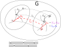
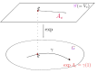

> `李群`是分析`流形对称性`的重要工具。
>
> 从李群$$G$$自身来看，李群$$G$$也是一个流形。
>
> 李群$$G$$作为流形在恒等元$$e$$有切空间$$V_e$$，在这切空间上定义双线性映射的`李括号`，以此作为切空间上的乘法，进而定义了`李代数`。
>
> 通过`指数映射`，可以在李群的李代数和李群自身之间建立关系。
>
> 李代数的`结构张量`，则是李括号双线性特征的显式表现。
>
> 符号说明：由于本节讨论的矢量场，并不涉及具体指标。所以简单用$$A$$代表矢量场$$A^a$$，用$$A_g$$代表点$$g$$的矢量。

<!--more-->

## 李群

`李群`，既是群也是流形。

- 从群的角度看，李群必须满足群乘法封闭性、群乘法结合律、存在恒等元$$e$$、存在逆元。
- 李群$$G$$的`李子群`$$H$$，不仅仅是$$G$$的子群，还必须同时是$$G$$的子流形。
- `李群同态`$$\rho:G\to G'$$，和群同态一致，即$$\rho(a b)=\rho(a)\rho(b),\quad \forall a,b\in G$$。
- `李群同构`$$\rho:G \overset{\mathrm{diff.}}{\longleftrightarrow} G'$$，和群同构一致，即一一到上的李群同态。考虑李群连续性，这个映射实际上也是微分同胚。

## 左平移

李群的特定元素$$g\in G$$给出的`左平移`$$L_g$$，

$$
\boxed{\begin{aligned}L_g:&G\to G\\ &h\mapsto L_g(h)\overset{\Delta}{=}gh\end{aligned}}
$$

- 左平移是一个微分同胚映射，也是李群$$G$$上的一个自同构；
- $$L_{gh}=L_g\circ L_h$$。

左平移$$L_g$$可以把曲线映射到曲线（如图），进而诱导出对矢量场$$A$$的`推前映射`$$L_{g*}$$，比如：$$L_{g*}A_e=A_g$$。这个`推前映射`$$L_{g*}$$也看成对矢量场左平移。

特别地，称矢量场$$A$$是`左不变的`，若$$L_{g*}A=A,\quad \forall g\in G$$。

- 左不变矢量场必然是$$C^\infty$$矢量场。
- 定义等价于：$$\boxed{(L_{g*}A)_{gh}=L_{g*}A_h}=A_{gh},\quad \forall g,h \in G$$。【结合上图示意：方框中等式左边（图中紫色）的意思是对矢量场$$A$$进行左平移映射（红虚线）后再$$gh$$处取值；方框中等式右边（图中蓝色）则是直接对矢量$$A_h$$进行左平移映射；这两者意思是一样的。方框外面的等号则源自左不变的定义】

> 李群$$G$$上全体左不变矢量场的集合$$\mathscr{L}$$构成矢量空间，并且与$$G$$在恒等元$$e$$的切空间$$V_e$$`同构`。

- 因为左不变的要求，本质就是把一个左不变矢量场，"压缩认同"为一个矢量，具体选择哪个矢量随意，所以不妨选恒等元处的矢量。  若把所有左不变矢量场都在恒等元处选一个代表之，于是上面的结论。

## 李代数

`李括号`，矢量空间$$V$$上的`双线性映射`$$[,]:V\times V\to V$$：，满足

1. 反称性： $$[A,B]=-[B,A],\quad \forall A,B\in V$$；
2. 雅可比行列式：$$[A,[B,C]]+[C,[A,B]]+[B,[C,A]]=0,\quad \forall A,B,C\in V$$

`李代数`，就是定义了李括号的矢量空间。

- `李代数同态`，自然是要保李括号的。
- `李代数同构`，就是一一到上的李代数同态。
- `阿贝尔李代数`，李括号始终为0的李代数。
- 李代数$$\mathscr{G}$$的`李子代数`$$\mathscr{H}$$，就是满足李括号封闭性子空间$$\mathscr{H}\subset \mathscr{G}$$。

根据 $$\phi_*[u,v]^a=[\phi_*u,\phi_*v]^a$$和左不变定义易知：两个左不变矢量场组成的李括号依然是左不变矢量场。 所以有：

> 李群$$G$$上全体左不变矢量场的集合$$\mathscr{L}$$是李代数（以矢量场对易子为李括号）。

有了矢量场对易子定义的`矢量场李括号`, 那么可在恒等元$$e\in G$$切空间$$V_e$$上定义`矢量李括号`：
$$
[A_e,B_e]\overset{\Delta}{=}[A,B]_e,\quad \forall A_e,B_e\in V_e
$$

有了恒等元切空间上的矢量李括号，可以证明$$V_e$$成为李代数，称为李群$$G$$的李代数，记作$$\mathscr{G}$$。

>  李群$$G$$和$$G'$$的李代数分别是$$\mathscr{G}$$和$$\mathscr{G}'$$，那么`李群同态`$$\rho:G\to G'$$，在恒等元$$e\in G$$所`诱导的前推映射`$$\rho_*:\mathscr{G}\to \mathscr{G}'$$是`李代数同态`。
>
>  如果$$H$$是$$G$$的`李子群`，那么$$\mathscr{H}$$必然是$$\mathscr{G}$$`李子代数`。

## 单参子群

李群$$G$$上的一条曲线$$\gamma$$，如果$$\gamma(s+t)=\gamma(s)\gamma(t),\forall s,t\in\mathbb{R}$$，那么$$\gamma$$是$$G$$的`单参子群`。

- 单参子群$$\gamma:\mathbb{R}\to G$$是从$$\mathbb{R}$$到$$G$$的李群同态映射；
- 李群$$G$$的单参子群$$\gamma$$必过恒等元$$e$$；
- 不变矢量场的每条不可延积分曲线的参数取遍算$$\mathbb{R}$$；
- 单参数子群是左不变矢量场经过$$e$$的不可延积分曲线，反之亦然。

最后一条结论表明：`左不变矢量场` 与 `单参子群` 有一一对应的关系。【因为：首先，李群$$G$$恒等元处切空间$$V_e$$和 `左不变矢量场集合`$$\mathscr{L}$$是一一对应的；其次，李群$$G$$的李代数$$\mathscr{G}$$（=$$V_e$$）的每个元素$$A_e\in \mathscr{G}$$ ​可生成一个单参数子群$$\gamma(t)$$。】于是，$$\mathscr{G}$$的每个元素称为一个（无限小）`生成元`。

## 指数映射

如图，利用“$$e$$点的一个矢量$$A_e$$决定唯一的单参子群”这一事实，可以定义指数映射。【注意：上图虚线连接的两个$$e$$点是重合的】

李群$$G$$的李代数$$\mathscr{G}$$到$$G$$`指数映射`是：
$$
\boxed{\begin{aligned}\exp: \mathscr{G} &\to G \\ A_e &\mapsto  \exp(A_e)\overset{\Delta}{=}\gamma(1) \\ \\ &  其中\gamma\text{是与}A_e\text{对应的单参子群} \end{aligned}}
$$

可以证明：

$$
\boxed{\exp(s A_e)=\gamma(s)},\quad \forall s\in\mathbb{R},A_e\in\mathscr{G}
$$

这意味着，由$$A_e\in\mathscr{G}$$决定的`单参子群`，可以表示成$$\exp(t A_e)$$。

进一步，由$$A_e\in\mathscr{G}$$对应的左不变矢量场$$A$$产生的`单参微分同胚群`$$\phi:\mathbb{R}\times G\to G$$，则可以表示成：

$$
\boxed{\phi_t(g)=g \exp(t A_e)},\quad \forall g\in G,t\in \mathbb{R}
$$

下面几条性质，说明`指数映射`是名副其实的：

- $$\exp(s A_e)\exp(t A_e)=\exp((s+t)A_e),\quad \forall s,t \in \mathbb{R}$$；
- $$\exp(-t A_e)=\exp(t A_e)^{-1},\quad \forall t \in \mathbb{R}$$；
- 如果李群$$G$$是可交换的，则：$$(\exp A_e)(\exp B_e)=\exp(A_e+B_e)$$。

如果$$\phi:H\to G$$是一个李群同态，那么基于下图映射路径的复合是可交换的：

此可交换性，按图可写成：
$$
\boxed{\phi(\exp A_e)=\exp(\phi_*A_e)},\quad \forall A_e \in \mathscr{H}
$$

## 正则坐标系

由群乘映射和求逆映射的光滑性出发，加上微分方程解对其初值的光滑依赖性，可知$$\exp:\mathscr{G}\to G$$是$$C^\infty$$映射。 由反函数定理可知，$$\mathscr{G}$$中存在包含恒等元$$e$$的开子集$$\mathscr{U}$$，并且$$G$$中也存在包含$$e$$的开子集$$U$$，使得$$\exp:\mathscr{U}\to U$$为`微分同胚`。

利用这个性质，并考虑$$\mathscr{G}(=V_e)$$是一个矢量空间，完全可在其上可给$$G$$定义局域坐标系，其坐标成为李群$$G$$的`正则坐标`。

## 李代数的结构（常数）张量

注意，这一小段恢复使用抽象指标。

#### 结构张量

考虑一个李代数$$\mathscr{V}$$，对应的`李括号`$$[,]:\mathscr{V}\times\mathscr{V}\to \mathscr{V}$$是双线性映射。这意味着也可把`李括号`看成一个$$(1,2)$$型张量，记作$$C^c_{\ \ ab}$$。即：
$$
\boxed{[v,u]^a=C^c_{\ \ ab}v^au^b},\quad \forall v,u\in \mathscr{V}
$$
我们将这个张量$$C^c_{\ \ ab}$$，称作李代数的`结构张量`。

#### 结构张量基本性质

李代数结构张量$$C^c_{\ \ ab}$$的基本性质:

- 下标反称：$$C^c_{\ \ ab}=-C^c_{\ \ ab}$$
- $$C^c_{\ \ a[b}C^a_{\ \ de]}=0$$【利用李括号的雅可比恒等式易证】

#### 结构常数

特别地，为$$\mathscr{V}$$选择一个基底$$\{(e_\mu)^a\}$$，于是有：
$$
[e_\mu,e_\upsilon]^c=C^c_{\ \  ab}(e_\mu)^a(e_\upsilon)^b=C^\sigma_{\ \ \mu\upsilon}(e_\sigma)^c
$$
其中，$$C^\sigma_{\ \ \mu\upsilon}$$称作李代数的`结构常数`，也是`结构张量`的分量。

#### 李氏第三基本定理

给定一组满足以下两条件的常数$$C^\sigma_{\ \ \mu\upsilon}$$：1）$$C^\sigma_{\ \ \mu\upsilon}=-C^\sigma_{\ \ \upsilon\mu}$$；2）$$C^\sigma_{\ \ \mu[\upsilon}C^\mu_{\ \ \rho\tau]}=0$$，必存在李群，其李代数以$$C^\sigma_{\ \ \mu\upsilon}$$为结构常数。

