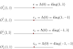
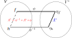

> 一般线性群$$GL(m)$$，全体可逆线性映射的集合。
>
> 正交群$$O(m)$$，正定度规下，全体保度规线性映射的集合。【正定度规下，保度规 $$\Longrightarrow$$ 保内积。】
>
> 洛伦兹群$$O(1,3)$$，正交归一基底下度规矩阵是$$\mathrm{diag}(-1,1,1,1)$$时，全体保度规线性映射的集合。
>
> 酉群$$U(m)$$，就是复数域中的全体保内积线性算符（即酉算符）的集合。

<!--more-->

## 一般线性群

考虑$$m$$维矢量空间$$V$$， $$\mathrm{GL}(m)$$代表$$V\to V$$的全体可逆线性映射的集合，以映射复合作为群乘法，恒等映射即为恒等元，易见$$\mathrm{GL}(m)$$构成李群。

因为$$V\to V$$的线性映射就是$$V$$上的$$(1,1)$$型张量，所以

$$
\mathrm{GL}(m)=\{T\in \mathscr{T}_V(1,1)\}
$$

为$$V$$取定一个基底（及其对偶基底），得到群元张量$$T$$的分量，即可逆矩阵（$$m^2$$个分量），此时单位矩阵为恒等元。于是得到与上面表示相互同构的另一个表示：

$$
\mathrm{GL}(m)=\{A\in M(m,\mathbb{R})| \det A\ne 0\}
$$

其中，$$M(m,\mathbb{R})$$代表$$m\times m$$实矩阵。

注意，$$\mathrm{GL}(m,\mathbb{R})$$是非紧且非连通李群，取其包含恒等元的一个连通李子群，记作：

$$
\mathrm{GL}^+(m)=\{A\in M(m,\mathbb{R})| \det A \gt 0\}
$$

$$\mathrm{GL}(m)$$的李代数$$\mathscr{G\!L}(m)$$，与全体实矩阵构成的矢量空间同构，即：

$$
\mathscr{G\!L}(m)=M(m,\mathbb{R})
$$

在这里，`指数数映射`具有显式的展开形式:

$$
\exp(A)=I+A+\frac{1}{2!}A^2+\frac{1}{3!}A^3+\dots,\quad \forall A\in \mathscr{G\!L}(m)
$$

## 正交群

如果考虑带正定度规的矢量空间$$(V,g_{ab})$$，可以在$$\mathrm{GL}(m)$$的基础上提出`保度规`的要求，即要求线性映射$$Z:V\to V$$保度规(方框中的要求)：
$$
\begin{aligned}&\boxed{g_{ab}(Z^a_{\ \ c}v^c)(Z^b_{\ \ d}u^d)=g_{cd}v^c u^d,\quad \forall v,u\in V} \\ \Longleftrightarrow & g_{ab}Z^a_{\ \ c}Z^b_{\ \ d}=g_{cd}\quad \text{【因为}v,u\text{选择的任意性】} \end{aligned}
$$

这类线性映射的集合构成的李群，称之为`正交群`$$O(m)$$：

$$
O(m)=\{Z^a_{\ \ b}\in \mathscr{T}_V(1,1)| g_{ab}Z^a_{\ \ c}Z^b_{\ \ d}=g_{cd}\}
$$

为$$(V,g_{ab})$$取定一个正交归一基底（及其对偶基底），于是：

$$
\begin{aligned}&g_{ab}Z^a_{\ \ c}Z^b_{\ \ d}=g_{cd}\\ \Longrightarrow & \delta_{\sigma\rho}=\delta_{\mu\upsilon}Z^\mu_{\ \ \sigma}Z^\upsilon_{\ \ \rho}=(Z^T)^{\ \ \mu}_\sigma\delta_{\mu\upsilon}Z^\upsilon_{\ \ \rho}\quad \text{【因为正交归一基底】}\\ \Longleftrightarrow & I=Z^T I Z = Z^T Z \quad \text{【写成矩阵形式】} \end{aligned}
$$

于是，$$O(m)$$可写成同构的形式：

$$
O(m)=\{Z\in \mathrm{GL}(m)| Z^T Z = I\}
$$

其中，$$I$$是单位矩阵，$$Z$$则是`正交矩阵`。$$O(m)$$是$$\mathrm{GL}(m)$$的最大紧致李子群。

特别地有：
$$
O(1)=\{1\}\cup\{-1\}
$$

$$
O(2)=\left\{\begin{bmatrix} \cos\alpha & -\sin\alpha \\ \sin\alpha & \cos\alpha \end{bmatrix}|\alpha\in \mathbb{R}\right\}\cup\left\{\begin{bmatrix} \cos\alpha & \sin\alpha \\ \sin\alpha & -\cos\alpha \end{bmatrix}|\alpha\in \mathbb{R}\right\}
$$

由于$$\det Z=\pm1$$，$$O(m)$$注定也是非连通的。 把包含恒等元的分支记作$$\mathrm{SO}(m)$$：

$$
\mathrm{SO}(m)=\{Z\in O(m)| \det A=1 \}
$$

称为`特殊正交群`。 最常用的是`三维空间转动群`$$SO(3)$$。

正交群$$O(m)$$和其李子群$$\mathrm{SO}(m)$$的有相同的李代数$$\mathscr{O}(m)$$：

$$
\mathscr{O}(m)=\{A\in M(m,\mathbb{R})| A^T = -A \}\\ \dim O(m)= \dim \mathscr{O}(m)=\frac{1}{2}m(m-1)
$$

## 洛伦兹群

和正交群$$O(3)$$的差别：不再要求是正定度规，但要求度规$$g_{ab}$$在正交归一基底下的度规矩阵是$$\mathrm{diag}(-1,1,1,1)$$。

类似$$O(3)$$可写出$$O(1,3)$$：

1） 线性映射集合视角

$$
O(1,3)=\{\Lambda^a_{\ \ b}\in \mathscr{T}_V(1,1)| g_{ab}\Lambda^a_{\ \ c}\Lambda^b_{\ \ d}=g_{cd}\}
$$

2）正交归一基底下矩阵集合视角

$$
O(1,3)=\{\Lambda\in \mathrm{GL}(m+1)| \Lambda^T \eta \Lambda = \eta\},\quad \eta\overset{\Delta}{=}\mathrm{diag}(-1,1,1,1)
$$

先看更简单的情况$$O(1,1)$$：

$$
\begin{aligned}O(1,1)&=O^\uarr_+(1,1)\cup O^\uarr_-(1,1)\cup O^\darr_-(1,1)\cup O^\darr_+(1,1)\\  O^\uarr_+(1,1)&= \left\{\begin{bmatrix} \mathrm{ch}\lambda & -\mathrm{sh}\lambda \\ -\mathrm{sh}\lambda & \cos\lambda \end{bmatrix}|\lambda\in \mathbb{R}\right\},\quad \det \Lambda=1,\Lambda^0_{\ \ 0}\ge 1\\ O^\uarr_-(1,1)&=\left\{\begin{bmatrix} \mathrm{ch}\lambda & -\mathrm{sh}\lambda \\ \mathrm{sh}\lambda & -\mathrm{ch}\lambda \end{bmatrix}|\lambda\in \mathbb{R}\right\},\quad \det \Lambda=-1,\Lambda^0_{\ \ 0}\ge 1\\ O^\darr_-(1,1)&=\left\{\begin{bmatrix} -\mathrm{ch}\lambda & \mathrm{sh}\lambda \\ -\mathrm{sh}\lambda & \mathrm{ch}\lambda \end{bmatrix}|\lambda\in \mathbb{R}\right\},\quad \det \Lambda=-1,\Lambda^0_{\ \ 0}\le -1\\ O^\darr_+(1,1)&=\left\{\begin{bmatrix} -\mathrm{ch}\lambda & \mathrm{sh}\lambda \\ \mathrm{sh}\lambda & -\mathrm{ch}\lambda \end{bmatrix}|\lambda\in \mathbb{R}\right\},\quad \det \Lambda=1,\Lambda^0_{\ \ 0}\le -1\end{aligned}
$$

**注意**: 其中只有$$O^\uarr_+(1,1)$$是李群$$O(1,1)$$的李子群。

类似地，洛伦兹群$$L=O(1,3)$$，也类似存在4个连通分支，每个分支各存在一个特殊元素：

$$
\begin{aligned}& L\text{的恒等元} &I&=\mathrm{diag}(1,1,1,1)&\in& L^\uarr_+\\ & L\text{的空间反射元} &r_s&=\mathrm{diag}(1,-1,-1,-1)&\in& L^\uarr_- = r_sL^\uarr_+ \\ & L\text{的时间反射元} &r_t&=\mathrm{diag}(-1,1,1,1)&\in& L^\darr_- = r_tL^\uarr_+ \\ & L\text{的时空反演元}& i_{ts}&=r_t r_s=-I&\in& L^\darr_+ = i_{ts}L^\uarr_+\end{aligned}
$$

其中只有包含恒等元的分支$$L^\uarr_+$$构成李群，是$$L$$的李子群，称为`固有洛伦兹群`，是6维连通流形，流形结构为$$\mathbb{R}^3\times SO(3)$$。

同$$O(3)$$类似，洛伦兹群$$L=O(1,3)$$及其李子群$$L^\uarr_+$$有相同的李代数$$\mathscr{O}(1,3)$$:：

$$
\mathscr{O}(1,3)=\{A\in M(4,\mathbb{R})| A^T \eta A = \eta \}\\ \dim O(1,3) = \dim \mathscr{O}(1,3) = \dim \mathscr{O}(4)=6
$$

## 酉群

如果把实矢量空间扩展称复矢量空间，那么$$\mathrm{GL}(m)$$对应$$\mathrm{GL}(m,\mathbb{C})$$，这个新群是连通李群（不存在多分支）。

我们知道正交群$$O(m)$$，有保度规的要求，进而必然保内积。而酉群$$U(m)$$，就是这种要求保内积的$$\mathrm{GL}(m,\mathbb{C})$$子群。但是复矢量空间的内积只对第二个矢量是线性的，对第一个矢量则为共轭线性。即：

$$
(g,f)=\overline{(f,g)},\quad \forall f,g\in V
$$

很明显，当复矢量空间$$V$$退化成实矢量空间时，内积对所作用的两个矢量都是`线性的`。

类似实矢量空间，线性映射$$\eta:V\to \mathbb{C}$$就是复矢量空间$$V$$对应的一个对偶矢量，所有对偶矢量的集合就是$$V$$的对偶矢量空间$$V^*$$。据此$$V$$上的每个线性映射（算符）$$A:V\to V$$可以诱导出$$V^*$$上的一个线性映射（算符）$$A^*:V^*\to V^*$$：

$$
\begin{aligned}A^*:&V^*\to V^* \\  &\eta \mapsto  A^*\eta \\ & (A^*\eta)(f)\overset{\Delta}{=}\eta(A f),\quad \forall f\in V \end{aligned}
$$

$$A^*$$称之为$$A$$的`对偶算符`。这是一个线性算符，并且$$A^*$$和$$A$$的对应关系也是`线性的`。

此外，我们还知道有限维矢量空间$$V$$和其对偶矢量空间$$V^*$$是相互同构的，记作$$\phi:V\to V^*$$，这是一个反线性映射。  进而$$V$$上线性算符$$A$$的对偶算符$$A^*$$又可自然诱导出$$V$$上的一个线性算符$$A^\dagger:V \to V$$，如图：

$$A^\dagger$$称之为$$A$$的`伴随算符`。这是一个线性算符，并且$$A^\dagger$$和$$A$$的对应关系则是`反线性的`(共轭线性)。

最后，借助对偶矢量作用于矢量得实数得特点，将`内积`定义为：

$$
(f,g)\overset{\Delta}{=}\eta_f g,\quad \quad \forall f,g\in V
$$

进而有$$\boxed{(f,Ag)=(A^\dagger f,g)}$$，因为：

$$
\begin{aligned}(f,Ag)&=n_f(Ag)\quad \text{【内积定义】}\\ &=(A^*\eta_f)(g)\quad \text{【对偶算符定义】}\\ &=\eta_h(g)=(h,g)\quad \text{【见上图标注,及内积定义】}\\ &=(A^\dagger f,g)\quad \text{【见上图标注】}\end{aligned}
$$

此外，$$\boxed{(f,Ag)=(Bf,g)\quad \Rightarrow \quad B=A^\dagger}$$，因为：

$$
\begin{aligned}&0=(Bf,g)-(A^\dagger f,g)=(Bf-A^\dagger f,g),\quad \forall f,g\in V\\ \Longrightarrow & 0=(Bf-A^\dagger f,Bf-A^\dagger f)\quad \text{因为}g\text{可任意选择}\\  \Longrightarrow &0=Bf-A^\dagger f\quad \text{相同矢量内积为0的充要条件}\\  \Longrightarrow &B=A^\dagger \quad \text{因为}f\text{可任意选择}\end{aligned}
$$

有上面的准备，下面就容易了。现在可以谈保内积的线性算符$$U$$，称之为`酉算符`（或 `幺正算符`）：

$$
(Uf,Ug)=(f,g),\quad \forall f,g\in V
$$

算符$$U$$为`酉算符`的充要条件是：$$U^\dagger U=\delta$$。其中，$$\delta$$是恒等算符。

为$$V$$选择一个正交归一基底$$\{e_i\}$$，$$V$$上任意算符$$A$$可用矩阵表示:

$$
A_{ij}=(e_i,A e_j)=(A^\dagger e_i,e_j)=\overline{(e_j,A^\dagger e_i)}=\overline{(A^\dagger)_{ji}}
$$

即：

$$
A^\dagger = \overline{A^T}
$$

进而，算符$$U$$为`酉算符`的充要条件的矩阵形式：$$U^{-1}=U^\dagger=\overline{A^T}$$。  对应的矩阵$$U$$称为`酉矩阵`（或 `幺正矩阵`）。

如果$$U$$为酉矩阵，那么：

$$
\det U=e^{i\varphi},\quad \varphi\in \mathbb{R},\quad \text{即} \left|\det U\right|=1
$$

所以，酉群$$U(m)$$可定义为：

$$
U(m)\overset{\Delta}{=}\{U\in \mathrm{GL}(m,\mathbb{C})| U^\dagger U = I\}
$$

酉群$$U(m)$$是紧致的连通流形。

$$A$$是`厄米矩阵`，若$$A^\dagger = A$$；  $$A$$是`反厄米矩阵`，若$$A^\dagger = -A$$；  

酉群$$U(m)$$的李代数$$\mathscr{U}(m)$$：

$$
\mathscr{U}(m)=\{A\in\mathscr{G\!L}(m,\mathbb{C})|A^\dagger=-A\}\\  \dim U(m)=\dim \mathscr{U}(m)=m^2
$$

特殊酉群$$\mathrm{SU}(m)$$可定义为：

$$
\mathrm{SU}(m)\overset{\Delta}{=}\{U\in U(m)| \det U=1 \}
$$

`特殊酉群`$$\mathrm{SU}(m)$$的李代数$$\mathscr{S\!U}(m)$$：

$$
\mathscr{S\!U}(m)=\{A\in\mathscr{U}(m)|\mathrm{tr} A=0\}\\  \dim \mathrm{SU}(m)=\dim \mathscr{S\!U}(m)=m^2-1
$$

