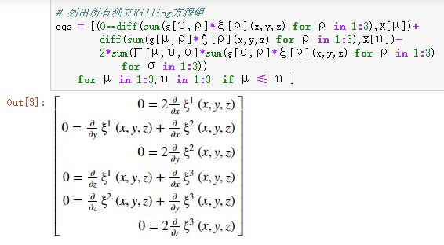

> 本文真是杀鸡用牛刀，但好处是彻底厘清了如何用对称性构造拉格朗日量的一般套路。
>
> 本文通过强算Killing方程的笨方法，来确定伽利略时空，特别是欧氏空间的完整对称性，进而得到无穷小生成元（变换），最后用这组无穷小变换在拉格朗日量上的不变性来确定拉格朗日量。

<!--more-->

## 伽利略时空

`伽利略时空流形`$$M$$的时间和空间是绝对分离的：$$M=\mathbb{R}^3\times \mathbb{R}$$。

`伽利略时空李群`(10维)：$$G=\mathrm{SO}(3)\times T(3)\times T(4)$$

- 空间平移群$$T(3)$$：$$x^\mu\to x^\mu+b^\mu$$
- 空间旋转群$$\mathrm{SO}(3)$$： $$x^\mu \to A^\mu_{\ \ \upsilon} x^\upsilon,\quad A^TA=I$$
- 时间平移群$$\mathbb{R}$$： $$t\to t+c$$
- 伽利略惯性平移群$$\mathbb{R}^3$$： $$x^\mu \to x^\mu +v^\mu t$$

$$M$$的空间部分（欧氏空间）$$\mathbb{R}^3$$的度规（线元表示）

$$
ds^2=(dx)^2+(dy)^2+(dz)^2
$$

伽利略时空$$M$$在李群$$G$$的作用下是`欧氏等度规李变换`，即`欧氏线元`是不变量。

## 欧氏空间的Killing矢量场

由于伽利略时空的时间和空间是绝对分离的，同时与时间相关的对称性都是平移，所以，有必要先单独分析三维欧氏空间的对称性。

可通过求解Killing方程确定欧氏空间的平移群$$T(3)$$和转动群$$\mathrm{SO}(3)$$。合起来对应Killing矢量的6个基底所张成的空间。 下面给出`Julia`代码：

```julia
using SymPy

# 选择欧氏坐标系
@vars x y z real=true
X = [x,y,z]

# 待求的Killing矢量场的分量
ξ = SymFunction("ξ^1,ξ^2,ξ^3")

# 欧氏度规及逆度规
g = sympy.eye(3) .* [1,1,1] 
gi = inv(g)

# 根据度规计算克氏符
Γ = sum([(1//2)*gi[σ,ρ]*(diff(g[μ,ρ],X[υ])+
            diff(g[υ,ρ],X[μ])-diff(g[μ,υ],X[ρ])) 
        for μ in 1:3,υ in 1:3 ,σ in 1:3] 
    for ρ in 1:3)

# 列出所有独立Killing方程组
eqs = [(0⩵diff(sum(g[υ,ρ]*ξ[ρ](x,y,z) for ρ in 1:3),X[μ])+
        diff(sum(g[μ,ρ]*ξ[ρ](x,y,z) for ρ in 1:3),X[υ])-
        2*sum(Γ[μ,υ,σ]*sum(g[σ,ρ]*ξ[ρ](x,y,z) for ρ in 1:3) 
            for σ in 1:3)) 
    for μ in 1:3,υ in 1:3  if μ ≤ υ ]
```



根据方程1、3、6，可设：

$$
\begin{aligned}\xi(x,y,z)&=\Big(\xi^1(x,y,z),\xi^2(x,y,z),\xi^3(x,y,z)\Big)^T\\&=\Big(f(y,z),g(x,z),h(x,y)\Big)^T\end{aligned}
$$

带入方程2、4、5，并分离变量得：

$$
\frac{\partial f(y,z)}{\partial y}=-\frac{\partial g(x,z)}{\partial x}=C_1(z)\\ \frac{\partial f(y,z)}{\partial z}=-\frac{\partial h(x,y)}{\partial x}=C_2(y)\\ \frac{\partial g(x,z)}{\partial z}=-\frac{\partial h(x,y)}{\partial y}=C_3(x)
$$

当$$C_1(z)=C_2(y)=C_3(x)=0$$时，有三个平移特解：

$$
\boxed{\begin{aligned}(\xi_4)^a=\left(\frac{\partial}{\partial x}\right)^a \overset{\Delta}{=}(e_1)^a\quad \xi_4=(1,0,0)^T\\ (\xi_5)^a=\left(\frac{\partial}{\partial y}\right)^a\overset{\Delta}{=}(e_2)^a \quad \xi_5=(0,1,0)^T\\ (\xi_6)^a=\left(\frac{\partial}{\partial z}\right)^a\overset{\Delta}{=}(e_3)^a\quad \xi_6=(0,0,1)^T\end{aligned}}
$$

当$$C_1(z)=C_2(y)=0,C_3(x)\ne0$$时，有一个沿$$x$$轴平移特解（前面已有），一个绕$$x$$轴转动特解（新解）：

$$
\boxed{(\xi_1)^a=z\left(\frac{\partial}{\partial y}\right)^a-y\left(\frac{\partial}{\partial z}\right)^a\quad \xi_1=(0,z,-y)^T}
$$

当$$C_1(z)=0,C_2(y)\ne 0,C_3(x)=0$$时，有一个沿$$y$$轴平移特解（前面已有），一个绕$$y$$轴转动特解（新解）：

$$
\boxed{(\xi_2)^a=-z\left(\frac{\partial}{\partial x}\right)^a+x\left(\frac{\partial}{\partial z}\right)^a\quad \xi_2=(-z,0,x)^T}
$$

当$$C_1(z)=0,C_2(y)\ne 0,C_3(x)\ne 0$$时，一个绕$$y$$轴转动特解（前面已有），一个绕$$x$$轴转动特解（前面已有）。

当$$C_1(z)\ne 0,C_2(y)= 0,C_3(x)=0$$时，一个沿$$z$$轴平移特解（前面已有），一个绕$$z$$轴转动特解（新解）：

$$
\boxed{(\xi_3)^a=y\left(\frac{\partial}{\partial x}\right)^a-x\left(\frac{\partial}{\partial y}\right)^a\quad \xi_3=(y,-x,0)^T}
$$

$$C_1(z),C_2(y),C_3(x)$$还剩下三种组合，但相关得特解都和前面重复了。

所以，三维欧氏空间的6维Killing矢量场，由三个平移$$\{(e_1)^a,(e_2)^a,(e_3)^a\}$$和三个转动$$\{(\xi_1)^a,(\xi_2)^a,(\xi_3)^a\}$$，一共6个特解张成。

这三个转动基底（特解）$$\{(\xi_1)^a,(\xi_2)^a,(\xi_3)^a\}$$，构成一个反对称矩阵，这就是$$\mathrm{SO}(3)$$的三个生成元，每列代表一个生成元（也是李代数$$\mathscr{S\!O}(3)$$上的三个基底）：

$$
\{\xi^\mu_{\ \ \upsilon}\}=\begin{bmatrix}0 & -z & y \\ z & 0 & -x \\ -y & x & 0 \end{bmatrix}
$$


于是，空间旋转群可改写成参数形式(利用了李代数到李群的指数映射)：

$$
\boxed{x^\mu\to \exp\left[\varepsilon \xi^\mu_{\ \ \upsilon}\right] x^\upsilon=x^\mu+\varepsilon \xi^\mu_{\ \ \upsilon} x^\upsilon=x^\mu+\xi^\mu_{\ \ \upsilon} \varepsilon^\upsilon}
$$

其中，$$\varepsilon$$是无穷小参数，$$\varepsilon^\upsilon=\varepsilon x^\mu$$则是$$\varepsilon$$诱导的三个无穷小量，对应$$\mathrm{SO}(3)$$的三个参数。

## 由伽利略时空对称性确定自由粒子的拉格朗日量

首先，在`空间、时间的无穷小平移变换`下，必须保持拉格朗量不变，这意味着拉格朗日量不显含位置和时间，即：

$$
L(\dot{x}^\mu)
$$

然后，在`无穷小空间转动变换`下，也必须保持拉格朗量不变（优先保证相等，其次也可精确到相差一个全微分），即：

$$
\begin{aligned}&L(\dot{x}^\mu+\dot{\xi}^\mu_{\ \ \upsilon} \varepsilon^\upsilon)=L(\dot{x}^\mu)+\frac{d}{dt}f(t,x^\mu) \quad \text{【代入无穷小转动】} \\  \Rightarrow \quad & \begin{cases}\dfrac{\partial L}{\partial \dot{x}^\mu} \dot{\xi}^\mu_{\ \ 1} \varepsilon^1=\dfrac{d}{dt}f_1(t,x^\mu)\\ \dfrac{\partial L}{\partial \dot{x}^\mu} \dot{\xi}^\mu_{\ \ 2} \varepsilon^2=\dfrac{d}{dt}f_2(t,x^\mu)\\ \dfrac{\partial L}{\partial \dot{x}^\mu} \dot{\xi}^\mu_{\ \ 3} \varepsilon^3=\dfrac{d}{dt}f_3(t,x^\mu)\end{cases} \quad \text{【保留一阶项】}\\  \Rightarrow \quad & \begin{cases}\dfrac{d}{dt}f_1(t,x,y,z)=\varepsilon^1 (\dot{z}\dfrac{\partial L}{\partial \dot{y}}-\dot{y}\dfrac{\partial L}{\partial \dot{z}})\\ \dfrac{d}{dt}f_2(t,x,y,z)=\varepsilon^2 (-\dot{z}\dfrac{\partial L}{\partial \dot{x}}+\dot{x}\dfrac{\partial L}{\partial \dot{z}})\\ \dfrac{d}{dt}f_3(t,x,y,z)=\varepsilon^3 (\dot{y}\dfrac{\partial L}{\partial \dot{x}}-\dot{x}\dfrac{\partial L}{\partial \dot{y}})\end{cases} \quad \text{【将Killing矢量转动基底代入】}\\  \Rightarrow \quad & \begin{cases}\dot{z}\dfrac{\partial L}{\partial \dot{y}}-\dot{y}\dfrac{\partial L}{\partial \dot{z}}=0\\ -\dot{z}\dfrac{\partial L}{\partial \dot{x}}+\dot{x}\dfrac{\partial L}{\partial \dot{z}}=0\\  \dot{y}\dfrac{\partial L}{\partial \dot{x}}-\dot{x}\dfrac{\partial L}{\partial \dot{y}}=0\end{cases} \quad \text{【确保变换后拉格朗日量不变】}\\  \Rightarrow \quad & \dfrac{\partial L}{\partial \dot{x}}/\dot{x}=\dfrac{\partial L}{\partial \dot{y}}/\dot{y}=\dfrac{\partial L}{\partial \dot{z}}/\dot{z}\\  \Rightarrow \quad & \boxed{L=L(\dot{x}^2+\dot{y}^2+\dot{z}^2)=L(v^2)}  \end{aligned}
$$

最后，在`无穷小伽利略惯性平移变换`下(变换的相对速度$$\vec{\varepsilon}\to 0$$)，也必须保持拉格朗量不变（优先保证相等，其次也可精确到相差一个全微分），即：

$$
\begin{aligned}&L(\left|\vec{v}+\vec{\varepsilon}\right|^2)=L(v^2)+\frac{d}{dt}f(t,\vec{r})\\ \Rightarrow \quad & L(v^2+2\vec{v}\cdot \vec{\varepsilon}+\varepsilon^2)=L(v^2)+\frac{d}{dt}f(t,\vec{r})\\ \Rightarrow \quad & 2\vec{v}\cdot \vec{\varepsilon}\frac{\partial L}{\partial v^2}=\frac{d}{dt}f(t,\vec{r})\end{aligned}
$$

我们注意到最后一个等式左边无法取0（因为$$L$$取常数无意义），那么只能保证是时间的全导数。进而只能取$$\dfrac{\partial L}{\partial v^2}$$为常数，即：

$$
L=\frac{m}{2}v^2
$$

其中，$$m$$成为质点的质量。

## 质点系的拉格朗日量

根据，各自完全独立系统的总拉格朗量等于部分拉格朗量之和，然后再补上表示各质点间相互作用的某个函数$$-U$$，则有封闭质点系拉格朗日量的一般形式:

$$
\boxed{L=\sum_\alpha{\frac{1}{2}m_\alpha v_\alpha^2}-U(\vec{r}_1,\vec{r}_2,\dots)}
$$

其中，$$T=\sum_\alpha{\frac{1}{2}m_\alpha v_\alpha^2}$$称为`系统动能`，$$U$$则成为`系统势能`。