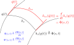

> 如果知道所有对称性，原则上可以写出具体拉格朗日量。如果只知道部分对称性，也可根据`Noether定理`得知对称性所关联的守恒律。
>
> `Noether定理`：每一个保持拉格朗日量不变的单参微分同胚群（对称性），必有运动方程组对应的一个首次积分（守恒律）。
>
> 套路：研究无穷小变换下的拉格朗日量变换。
>
> 然后，就是三个经典范例。

<!--more-->

## Noether定理

令是$M$一光滑流形，$L:T\!M\to \mathbb{R}$则是切丛上的光滑函数（拉格朗日量）。

如果存在一个单参微分同胚$h:\mathbb{R}\times M\to M$，能够保证拉格朗日量$L$不变，即：

$$
L(h_{s*}v)=L(v),\quad s\to0,\quad \forall s\in \mathbb{R},v\in T\!M
$$

选择一个局域坐标$\{q^\mu\}$ ，于是$v=(q^\mu,\dot{q}^\mu)\in T\!M$，并以下图示意，约定关于变换$h_s$及其推前映射$h_{s*}$的相关符号（推导及图中略去了上标$\mu$，事实上存在关于$\mu$的缩并）：

在变换$h_s:M\to M$的作用下，拉格朗日量$L$不变，即

$$
\begin{aligned}&0=\frac{\partial L(\Phi,\dot{\Phi})}{\partial s}=\frac{\partial L}{\partial q}\Phi'+\frac{\partial L}{\partial \dot{q}}\dot{\Phi}'\\ \Rightarrow \quad & 0=\left(\frac{\partial}{\partial t}\frac{\partial L}{\partial \dot{q}}\right)\Phi'+\frac{\partial L}{\partial \dot{q}}\dot{\Phi}'\\  \quad & \ \ = \frac{\partial}{\partial t}\left(\frac{\partial L}{\partial \dot{q}}\Phi'\right)\\ \Rightarrow \quad & I= \frac{\partial L}{\partial \dot{q}}\Phi'\end{aligned}
$$

其中，$I$就是首次积分常数，可改写成：

$$
I(q^\mu,\dot{q}^\mu)=\frac{\partial L}{\partial \dot{q}^\mu}\left.\frac{dh_s(q^\mu)}{ds}\right|_{s=0}
$$

着就是著名的`Noether定理`：

> 每一个保持拉格朗日量不变的单参微分同胚群，必有运动方程组对应的一个首次积分。

## 范例：时间平移不变性对应能量守恒

时间平移无穷小变换： $t\to t+\varepsilon$。

在无穷小变换下的拉格朗日量要么不变，要么相差一个关于时间全导数：

$$
\begin{aligned}&L(t+\varepsilon,q^\mu,\dot{q}^\mu)=L(t,q^\mu,\dot{q}^\mu)+\frac{d}{dt}f(t,q^\mu)\\ \Rightarrow \quad & \frac{\partial L}{\partial t}\varepsilon=\frac{d}{dt}f(t,q^\mu)\\ \Rightarrow \quad & \frac{\partial L}{\partial t}=0\quad \text{【时间平移不变说明拉氏量不含时间】}\\ \Rightarrow \quad & \frac{d L}{d t}=\frac{\partial L}{\partial q^\mu}\dot{q}^\mu+\frac{\partial L}{\partial \dot{q}^\mu}\ddot{q}^\mu\\  & \quad \ \ =\frac{d}{dt}\left(\frac{\partial L}{\partial \dot{q}^\mu}\right)\dot{q}^\mu+\frac{\partial L}{\partial \dot{q}^\mu}\ddot{q}^\mu\quad \text{【带入拉氏方程】}\\  & \quad \ \ =\frac{d}{dt}\left(\frac{\partial L}{\partial \dot{q}^\mu}\dot{q}^\mu\right)\\ \Rightarrow \quad & \frac{d}{dt}\left(\frac{\partial L}{\partial \dot{q}^\mu}\dot{q}^\mu-L\right)=0\\ \Rightarrow \quad & \boxed{E=\frac{\partial L}{\partial \dot{q}^\mu}\dot{q}^\mu-L}\end{aligned}
$$

方框中的积分常数$E$，就是`系统能量`。

## 范例：空间平移不变性对应动量守恒

空间平移无穷小变换：$x^\mu\to x^\mu+\varepsilon^\mu$。

于是所有质点同时无穷小平移：$\vec{r}_i\to \vec{r}_i+\vec{\varepsilon},\quad i=1,2,\dots$

继续类似的套路

$$
\begin{aligned}&L(\vec{r}_i+\vec{\varepsilon},\vec{v}_i)=L(\vec{r}_i,\vec{v}_i)+\frac{d}{dt}f(t,\vec{r}_i)\\ \Rightarrow \quad & \vec{\varepsilon}\cdot \sum_i{\frac{\partial L}{\partial \vec{r}_i}}=\frac{d}{dt}f(t,\vec{r}_i)\quad \text{【三个相互独立的无穷小变量】}\\ \Rightarrow \quad & \sum_i{\frac{\partial L}{\partial \vec{r}_i}}=0\\ \Rightarrow \quad & \frac{d}{dt}\sum_i{\frac{\partial L}{\partial \vec{v}_i}}=0\quad \text{【根据拉氏方程】}\\ \Rightarrow \quad & \boxed{\vec{P}=\sum_i{\frac{\partial L}{\partial \vec{v}_i}}=\sum_i{p_i}}\end{aligned}
$$

方框中的积分常数$\vec{P}$，就是`封闭系统总动量`。$p_i$则是单个质点的动量。

## 范例：空间旋转不变性对应角动量守恒

空间旋转无穷小变换：$x^\mu\to x^\mu+\xi^\mu_{\ \ \upsilon} \varepsilon^\upsilon$。

于是所有质点同时无穷小旋转：

$$
\vec{r}_i\to \vec{r}_i+\Xi_i\ \vec{\varepsilon},\quad\vec{v}_i\to \vec{v}_i+\dot{\Xi}_i\ \vec{\varepsilon},\quad i=1,2,\dots
$$

其中，$\Xi_i$是上一节Killing矢量场三个旋转基底组成的矩阵，每列对应一个基底：

$$
\Xi_i=\begin{bmatrix}0 & -z_i & y_i \\ z_i & 0 & -x_i \\ -y_i & x_i & 0 \end{bmatrix}
$$

于是：

$$
\begin{aligned}&L(\vec{r}_i+\Xi_i\ \vec{\varepsilon},\vec{v}_i+\dot{\Xi}_i\ \vec{\varepsilon})=L(\vec{r}_i,\vec{v}_i)+\frac{d}{dt}f(t,\vec{r}_i)\\ \Rightarrow \quad & \sum_i{\left(\frac{\partial L}{\partial \vec{r}_i}\Xi_i+\frac{\partial L}{\partial \vec{v}_i}\dot{\Xi}_i\right)} \vec{\varepsilon}=\frac{d}{dt}f(t,\vec{r}_i)\quad \text{【三个相互独立的无穷小变量】}\\ \Rightarrow \quad &\sum_i{\left(\frac{d }{d t}\left(\frac{\partial L}{\partial \vec{v}_i}\right)\Xi_i+\frac{\partial L}{\partial \vec{v}_i}\dot{\Xi}_i\right)}\vec{\varepsilon}=\frac{d}{dt}f(t,\vec{r}_i)\quad \text{【根据拉氏方程】}\\ \Rightarrow \quad & \frac{d }{d t}\left(\sum_i{\frac{\partial L}{\partial \vec{v}_i}\Xi_i}\right)\vec{\varepsilon}=\frac{d}{dt}f(t,\vec{r}_i)\\ \Rightarrow \quad & \frac{d }{d t}\left(\sum_i{\frac{\partial L}{\partial \vec{v}_i}\Xi_i}\right)=0\\ \Rightarrow \quad & \boxed{\vec{M}=\sum_i{\frac{\partial L}{\partial \vec{v}_i}\Xi_i}=\sum_i{\vec{r}_i\times\vec{p}_i}}\end{aligned}
$$

其中：

$$
\begin{aligned}\frac{\partial L}{\partial \vec{v}}\Xi=\left[p_x\quad p_y\quad p_z\right]\begin{bmatrix}0 & -z & y \\ z & 0 & -x \\ -y & x & 0 \end{bmatrix}=\vec{r}\times\vec{p}\\\end{aligned}
$$

方框中的积分常数$\vec{M}$，就是`封闭系统总角动量`。

