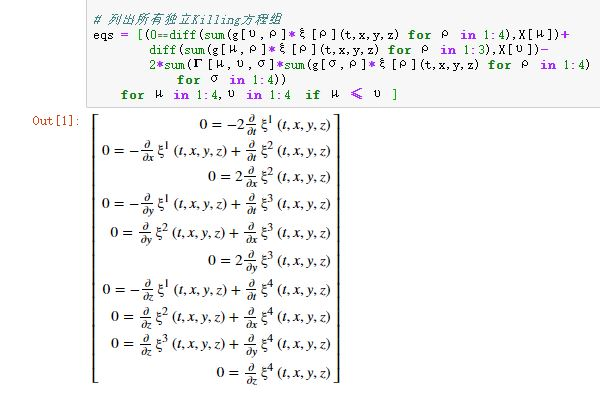

> 本篇依次从Killing矢量场、张量（矩阵）、旋量三个角度考察闵氏时空的对称性。
>
> 最后，从旋量概念引入自旋概念。
>
> 本篇涉及的草稿：https://gitee.com/chaoskey/notes/blob/master/code/0080.ipynb

<!--more-->

## 闵氏时空对称性

闵氏时空，作为一种带度规的时空流形$(M,g_{ab})$

$$
g_{ab}=\eta_{\mu\upsilon}g^\mu_{\ \ a}g^\upsilon_{\ \ b}\quad \eta_{\mu\upsilon}=\mathrm{diag}(-1,1,1,1)
$$

其对称性表现为`保度规`，描述此种对称性的李群，就是`等度规群`。特别地，闵氏时空下的等度规群，就是`庞加莱群`。

本篇，从三个角度考察庞加莱群：

1）Killing矢量场观点【主动观点】；

2）张量观点【被动观点】

3）旋量观点

## Killing矢量场观点

作为`庞加莱群`的子群，`单参等度规（局域）群`，所对应的矢量场是一个Killing矢量场。很自然，可通过求解Killing方程来确定庞加莱群的李代数。

```julia
using SymPy
using LinearAlgebra

# 选择洛伦兹坐标系
@vars t x y z real=true
X = [t,x,y,z]

# 闵氏度规及逆度规
g = sympy.diag(-1,1,1,1)
gi = inv(g)


# 待求的Killing矢量场的分量
ξ = SymFunction("ξ^1,ξ^2,ξ^3,ξ^4")


# 根据度规计算克氏符
Γ = sum([(1//2)*gi[σ,ρ]*(diff(g[μ,ρ],X[υ])+
            diff(g[υ,ρ],X[μ])-diff(g[μ,υ],X[ρ])) 
        for μ in 1:4,υ in 1:4 ,σ in 1:4] 
    for ρ in 1:4)

# 列出所有独立Killing方程组
eqs = [(0⩵diff(sum(g[υ,ρ]*ξ[ρ](t,x,y,z) for ρ in 1:4),X[μ])+
        diff(sum(g[μ,ρ]*ξ[ρ](t,x,y,z) for ρ in 1:3),X[υ])-
        2*sum(Γ[μ,υ,σ]*sum(g[σ,ρ]*ξ[ρ](t,x,y,z) for ρ in 1:4) 
            for σ in 1:4)) 
    for μ in 1:4,υ in 1:4  if μ ≤ υ ]
```



通过分离变量法，逐个获得10个特解【参见我的草稿】，分成三组：

（一）4个平移：

$$
(\xi_{t_0})^a=\left(\frac{\partial}{\partial t}\right)^a,(\xi_{t_1})^a=\left(\frac{\partial}{\partial x}\right)^a,(\xi_{t_2})^a=\left(\frac{\partial}{\partial y}\right)^a,(\xi_{t_3})^a=\left(\frac{\partial}{\partial z}\right)^a
$$

（二）3个空间转动：

$$
(\xi_{r_1})^a=z\left(\frac{\partial}{\partial y}\right)^a-y\left(\frac{\partial}{\partial z}\right)^a\\ (\xi_{r_2})^a=x\left(\frac{\partial}{\partial z}\right)^a-z\left(\frac{\partial}{\partial x}\right)^a\\ (\xi_{r_3})^a=y\left(\frac{\partial}{\partial x}\right)^a-x\left(\frac{\partial}{\partial y}\right)^a
$$

（三）3个伪转动（boost）：

$$
(\xi_{b_1})^a=x\left(\frac{\partial}{\partial t}\right)^a+t\left(\frac{\partial}{\partial x}\right)^a\\ (\xi_{b_2})^a=y\left(\frac{\partial}{\partial t}\right)^a+t\left(\frac{\partial}{\partial y}\right)^a\\ (\xi_{b_3})^a=z\left(\frac{\partial}{\partial t}\right)^a+t\left(\frac{\partial}{\partial z}\right)^a
$$

通过细致的计算【参见我的草稿】，可算出对应李代数的结构常数：

$$
\begin{aligned}\quad  &[\textcolor{red}{\xi_{t_i}},\textcolor{red}{\xi_{t_j}}]^a=0 \quad &[\textcolor{blue}{\xi_{r_i}},\textcolor{blue}{\xi_{r_j}}]^a=\varepsilon^k_{\ \ ij}\left(\textcolor{blue}{\xi_{r_k}}\right)^a \\&  [\textcolor{green}{\xi_{b_i}},\textcolor{green}{\xi_{b_j}}]^a=-\varepsilon^k_{\ \ ij}\left(\textcolor{blue}{\xi_{r_k}}\right)^a \quad & \\&  [\xi_{t_0},\textcolor{blue}{\xi_{r_i}}]^a=0 \quad &[\textcolor{red}{\xi_{t_i}},\textcolor{blue}{\xi_{r_j}}]^a=\varepsilon^k_{\ \ ij}\left(\textcolor{red}{\xi_{t_k}}\right)^a \\  & [\xi_{t_0},\textcolor{green}{\xi_{b_i}}]^a=\left(\textcolor{red}{\xi_{t_i}}\right)^a \quad & [\textcolor{red}{\xi_{t_i}},\textcolor{green}{\xi_{b_j}}]^a=\delta_{ij}\left(\xi_{t_0}\right)^a \quad \\  & [\textcolor{blue}{\xi_{r_i}},\textcolor{green}{\xi_{b_j}}]^a=\varepsilon^k_{\ \ ij}\left(\textcolor{green}{\xi_{b_k}}\right)^a  \quad &   \end{aligned}
$$

进一步引入记号$\textcolor{red}{l_{\mu\upsilon}}=l_{[\mu\upsilon]}\quad \mu,\upsilon=0,1,2,3$【注意每一个分量都是一个生成元矢量】：

$$
l_{01}=b_1\quad l_{02}=b_2\quad l_{03}=b_3\\ l_{12}=r_3\quad l_{23}=r_1\quad l_{31}=r_2\\ \quad \\ \textcolor{red}{l_{\mu\upsilon}}=\begin{pmatrix}0 & b_1 & b_2 & b_3 \\ -b_1 & 0 & r_3 & -r_2 \\ -b_2 & -r_3 & 0 & r_1 \\ -b_3 & r_2 & -r_1 & 0 \end{pmatrix}
$$

于是前面堆等式可浓缩为【参见我的草稿】

$$
[\xi_{l_{\mu\upsilon}},\xi_{l_{\sigma\rho}}]^a=-\eta_{\mu\rho}(\xi_{l_{\upsilon\sigma}})^a-\eta_{\upsilon\sigma}(\xi_{l_{\mu\rho}})^a+\eta_{\mu\sigma}(\xi_{l_{\upsilon\rho}})^a+\eta_{\upsilon\rho}(\xi_{l_{\mu\sigma}})^a \\ [\xi_{l_{\mu\upsilon}},\xi_{t_\sigma}]^a=-\eta_{\mu\sigma}(\xi_{t_\upsilon})^a+\eta_{\upsilon\sigma}(\xi_{t_\mu})^a
$$

对应的分量

$$
\xi_{l_{\mu\upsilon}}^{\ \ \beta}\partial_\beta\xi_{l_{\sigma\rho}}^{\ \ \alpha}-\xi_{l_{\sigma\rho}}^{\ \ \beta}\partial_\beta\xi_{l_{\mu\upsilon}}^{\ \ \alpha}=-\eta_{\mu\rho}\xi_{l_{\upsilon\sigma}}^{\ \ \alpha}-\eta_{\upsilon\sigma}\xi_{l_{\mu\rho}}^{\ \ \alpha}+\eta_{\mu\sigma}\xi_{l_{\upsilon\rho}}^{\ \ \alpha}+\eta_{\upsilon\rho}\xi_{l_{\mu\sigma}}^{\ \ \alpha} \\ \xi_{l_{\mu\upsilon}}^{\ \ \beta}\partial_\beta\xi_{t_{\sigma}}^{\ \ \alpha}-\xi_{t_{\sigma}}^{\ \ \beta}\partial_\beta\xi_{l_{\mu\upsilon}}^{\ \ \alpha}=\eta_{\mu\sigma}\xi_{t_\upsilon}^{\ \ \alpha}-\eta_{\upsilon\sigma}\xi_{t_\mu}^{\ \ \alpha}
$$

## 张量（矩阵）观点

在《[常用李群及其李代数]()》中提及的洛伦兹群，就是从张量角度看的。 本小节不再复述，这里仅仅把 Killing矢量场观点和张量观点联系起来。

从根上看，两个观点都是基于保度规的，每个Killing矢量场对应一个单参等度规群，而其每个群元作用于流形上，是基于操作的“主动变换”。 换个角度，这种“主动”必然对应“被动”，那就是坐标变换。

以这个Killing矢量场$(\xi_{r_1})^a$为例

$$
(\xi_{r_1})^a=z\left(\frac{\partial}{\partial y}\right)^a-y\left(\frac{\partial}{\partial z}\right)^a
$$

假设$(\xi_{r_1})^a$对应的单参等度规群的参数是$\varphi$,那么

$$
(\xi_{r_1})^a=\left(\frac{\partial}{\partial \varphi}\right)^a
$$

比较上面两种形式，得到$(\xi_{r_1})^a$积分曲线$C(\varphi)$的参数方程：

$$
\frac{dy(\varphi)}{d\varphi}=z\quad \frac{dz(\varphi)}{d\varphi}=-y\\ p=C(0),\quad y(0)=y_p,\quad z(0)=z_p
$$

不难求解出：

$$
y(\varphi)=y_p \cos\varphi+z_p\sin\varphi\quad z(\varphi)=-y_p\sin\varphi+z_p\cos\varphi
$$

很明显，这就我们熟知的，绕$x$轴旋转的坐标变换形式。不难写出坐标变换所对应的矩阵（由主动到被动反向：$\varphi\to -\varphi$）：

$$
Z_x(\varphi)=\begin{pmatrix}1 & 0 & 0 & 0 \\ 0 & 1 & 0 & 0\\ 0 & 0 & \cos\varphi & -\sin\varphi \\ 0 & 0 & \sin\varphi & \cos \varphi\end{pmatrix}
$$

进而可直接求出对应的生成元

$$
r_1=\left.\frac{d}{d\varphi}\right|_{\varphi\to 0}Z_x(\varphi)=\begin{pmatrix}0 & 0 & 0 & 0 \\ 0 & 0 & 0 & 0\\ 0 & 0 & 0 & -1 \\ 0 & 0 & 1 & 0 \end{pmatrix}
$$

类似地，我们可以求出固有洛伦兹群$L^\uparrow_+$的6个典型单参子群的矩阵：

$$
\begin{pmatrix}1 & 0 & 0 & 0 \\ 0 & 1 & 0 & 0\\ 0 & 0 & \cos\varphi & -\sin\varphi \\ 0 & 0 & \sin\varphi & \cos \varphi\end{pmatrix}\begin{pmatrix}1 & 0 & 0 & 0 \\ 0 &  \cos\varphi & 0 & \sin\varphi \\ 0 & 0 & 1 & 0 \\ 0 &  -\sin\varphi & 0 & \cos \varphi\end{pmatrix}\begin{pmatrix}1 & 0 & 0 & 0 \\ 0 & \cos\varphi & -\sin\varphi & 0 \\ 0 & \sin\varphi & \cos\varphi & 0 \\ 0 & 1 & 0 & 0\end{pmatrix}\\ \begin{pmatrix}\cosh\varphi & -\sinh\varphi & 0 & 0 \\ -\sinh\varphi & \cosh\varphi & 0 & 0 \\ 0 & 0 & 1 & 0 \\  0 & 0 & 0 & 1\end{pmatrix}\begin{pmatrix}\cosh\varphi & 0 & -\sinh\varphi & 0 \\ 0 & 1 & 0 & 0 \\ -\sinh\varphi & 0&  \cosh\varphi & 0 \\  0 & 0 & 0 & 1\end{pmatrix}\begin{pmatrix}\cosh\varphi & 0 & 0 & -\sinh\varphi \\ 0 & 1 & 0 & 0 \\  0 & 0 & 1 & 0 \\ -\sinh\varphi & 0& 0 & \cosh\varphi \end{pmatrix}
$$

对应的生成元$r_1,r_2,r_3,b_1,b_2,b_3$：

$$
\begin{pmatrix}0 & 0 & 0 & 0 \\ 0 & 0 & 0 & 0\\ 0 & 0 & 0 & -1 \\ 0 & 0 & 1 & 0 \end{pmatrix}\begin{pmatrix}0 & 0 & 0 & 0 \\ 0 &  0 & 0 & 1 \\ 0 & 0 & 0 & 0 \\ 0 &  -1 & 0 & 0 \end{pmatrix}\begin{pmatrix}0 & 0 & 0 & 0 \\ 0 & 0 & -1 & 0 \\ 0 & 1 & 0 & 0 \\ 0 & 0 & 0 & 0 \end{pmatrix}\\ \begin{pmatrix} 0 & -1 & 0 & 0 \\ -1 & 0 & 0 & 0 \\ 0 & 0 & 0 & 0 \\  0 & 0 & 0 & 0 \end{pmatrix}\begin{pmatrix}0 & 0 & -1 & 0 \\ 0 & 0 & 0 & 0 \\ -1 & 0&  0 & 0 \\  0 & 0 & 0 & 0 \end{pmatrix}\begin{pmatrix}0 & 0 & 0 & -1 \\ 0 & 0 & 0 & 0 \\  0 & 0 & 0 & 0 \\ -1 & 0& 0 & 0 \end{pmatrix}
$$

实际上，通过比较这些生成元和对应的特解Killing矢量场，我们还能很直观地发现两种观点的同构性：

$$
\boxed{\xi_{r_i}=-X^T r_i^{\ \ T} \frac{\partial}{\partial X}\quad \xi_{b_i}=-X^T b_i^{\ \ T} \frac{\partial}{\partial X}}\\ X\overset{\Delta}{=}[t,x,y,z]^T\quad 
$$

此外，需要注意的是：平移没有同维的生成元矩阵形式，但有高一维的生成元矩阵。平移生成元$t_0,t_1,t_2,t_3$:

$$
t_0=\begin{pmatrix}0 & 0 & 0 & 0 & 1 \\ 0 & 0 & 0 & 0 & 0 \\  0 & 0 & 0 & 0 & 0 \\ 0 & 0& 0 & 0 & 0  \\ 0 & 0& 0 & 0 & 0  \end{pmatrix}\quad t_1=\begin{pmatrix}0 & 0 & 0 & 0 & 0 \\ 0 & 0 & 0 & 0 & 1 \\  0 & 0 & 0 & 0 & 0 \\ 0 & 0& 0 & 0 & 0  \\ 0 & 0& 0 & 0 & 0  \end{pmatrix}\\ t_2=\begin{pmatrix}0 & 0 & 0 & 0 & 0 \\ 0 & 0 & 0 & 0 & 0 \\  0 & 0 & 0 & 0 & 1 \\ 0 & 0& 0 & 0 & 0  \\ 0 & 0& 0 & 0 & 0  \end{pmatrix}\quad t_3=\begin{pmatrix}0 & 0 & 0 & 0 & 0 \\ 0 & 0 & 0 & 0 & 0 \\  0 & 0 & 0 & 0 & 0 \\ 0 & 0& 0 & 0 & 1  \\ 0 & 0& 0 & 0 & 0  \end{pmatrix}
$$

进而，不得不将转动和伪转动生成元矩阵都扩张成5维，扩展部分补0。【如果无需和平移混合运算的话，则无需扩展】

可以验证【参见我的草稿】，也能很直观看出两种观点的同构性：

$$
\begin{aligned}\quad  &[\textcolor{red}{t_i},\textcolor{red}{t_j}]=0 \quad &[\textcolor{blue}{r_i},\textcolor{blue}{r_j}]=\varepsilon^k_{\ \ ij}\textcolor{blue}{r_k} \\&  [\textcolor{green}{b_i},\textcolor{green}{b_j}]=-\varepsilon^k_{\ \ ij}\textcolor{blue}{r_k} \quad & \\&  [t_0,\textcolor{blue}{r_i}]=0 \quad &[\textcolor{red}{t_i},\textcolor{blue}{r_j}]=\varepsilon^k_{\ \ ij}\textcolor{red}{t_k} \\  & [t_0,\textcolor{green}{b_i}]=\textcolor{red}{t_i} \quad & [\textcolor{red}{t_i},\textcolor{green}{b_j}]=\delta_{ij}t_0 \quad \\  & [\textcolor{blue}{r_i},\textcolor{green}{b_j}]=\varepsilon^k_{\ \ ij}\textcolor{green}{b_k}  \quad &   \end{aligned}
$$

和前面类似，进一步引入记号$\textcolor{red}{l_{\mu\upsilon}}=l_{[\mu\upsilon]}\quad \mu,\upsilon=0,1,2,3$，每个分量的分配和前面完全一样。根据这种分配，每一个分量都是一个生成元矩阵，有更简洁的表示【参见我的草稿】:

$$
\left(l_{\mu\upsilon}\right)^\alpha_{\ \ \beta}=-\delta^\alpha_{\ \ \mu}\eta_{\beta\upsilon}+\delta^\alpha_{\ \ \upsilon}\eta_{\beta\mu}
$$

进而不难验证，上面矩阵形式的结构常数关系可浓缩为【参见我的草稿】：

$$
[l_{\mu\upsilon},l_{\sigma\rho}]=-\eta_{\mu\rho}l_{\upsilon\sigma}-\eta_{\upsilon\sigma}l_{\mu\rho}+\eta_{\mu\sigma}l_{\upsilon\rho}+\eta_{\upsilon\rho}l_{\mu\sigma} \\ [l_{\mu\upsilon},t_\sigma]=\eta_{\mu\sigma}t_\upsilon-\eta_{\upsilon\sigma}t_\mu
$$

## 庞加莱群的简洁表示

前面无论是Killing矢量场观点，还是张量（矩阵）观点，都有完全一样的形式【同构表示】，

首先是**洛伦兹群**，可以用生成元矩阵表示:

$$
\left(l_{\mu\upsilon}\right)^\alpha_{\ \ \beta}\cong \left(\xi_{l_{\mu\upsilon}}\right)^a
$$

每个生成元$l_{\mu\upsilon}=l_{[\mu\upsilon]}$都对应一个单参微分同胚群，也可将这些参数组成一个反称张量（矩阵）$\omega_{\mu\upsilon}=\omega_{[\mu\upsilon]}$，进而得到洛伦兹群的一般简洁表示：

$$
\boxed{\Lambda = \exp\left\{\frac{1}{2}\omega_{\mu\upsilon}l^{\mu\upsilon}\right\}=\exp\left\{-\frac{i}{2}\omega_{\mu\upsilon}J^{\mu\upsilon}\right\}}\\ J^{\mu\upsilon}\overset{\Delta}{=}i\ l^{\mu\upsilon}
$$

其中，$1/2$是由于反称性导致的重复求和； 引入虚数$i$是有意为之，如果将$J^{\mu\upsilon}$代替$l^{\mu\upsilon}$作为生成元，那么$J^{\mu\upsilon}$就是厄米的。

从$J^{\mu\upsilon}$中提取矢量（利用了前面关于$l_{\mu\upsilon}$的构造）

$$
\boxed{J^\alpha\overset{\Delta}{=}\frac{1}{2}\epsilon^\alpha_{\ \beta\gamma}J^{\beta\gamma}}=ir^\alpha\quad \boxed{K^\alpha\overset{\Delta}{=}J^{\alpha 0}}=-ib^\alpha\quad \alpha=1,2,3
$$

从$\omega^{\mu\upsilon}$提取矢量：

$$
\boxed{\theta^\alpha\overset{\Delta}{=}\frac{1}{2}\epsilon^\alpha_{\ \beta\gamma}\omega^{\beta\gamma}\quad \eta^\alpha\overset{\Delta}{=}\omega^{\alpha 0}}\quad \alpha=1,2,3\\  \omega^{\alpha0}=-\omega_{\alpha0}\quad \omega^{\alpha\beta}=\omega_{\alpha\beta}  
$$

进而

$$
\boxed{\frac{1}{2}\omega_{\mu\upsilon}J^{\mu\upsilon}=\boldsymbol{\theta}\cdot\boldsymbol{J}-\boldsymbol{\eta}\cdot\boldsymbol{K}}
$$

其中负号源自$\omega_{i0}=-\omega^{i0}=-\eta^i$。

于是，洛伦兹群还可以表示为：

$$
\boxed{\Lambda =\exp\left\{-i\boldsymbol{\theta}\cdot\boldsymbol{J}+i\boldsymbol{\eta}\cdot\boldsymbol{K}\right\}}
$$

其次是**平移群**，其生成元矩阵：

$$
\left(t_{\mu}\right)^\alpha_{\ \ \beta}\cong (\xi_{t_\mu})^a
$$

每个生成元$t_{\mu}$都对应一个单参微分同胚群，此参数数记作$a_{\mu}$，进而得到平移群的表示【这里的$t$是"平移"的意思，以后用$P$表示】：

$$
\boxed{\exp\left\{a_\mu t^\mu\right\}=\exp\left\{-ia_\mu P^\mu\right\}}\\ P^\mu\overset{\Delta}{=}i\ t^\mu\\ t^0=-t_0\quad t^i=t_i
$$

**庞加莱群**是平移群与洛伦兹群的直积。

最后，李代数的结构常数可改写成：

$$
\boxed{\begin{aligned}\quad  &[\textcolor{red}{P^i},\textcolor{red}{P^j}]=0 \quad &[\textcolor{blue}{J^i},\textcolor{blue}{J^j}]=i \ \varepsilon_k^{\ \ ij}\textcolor{blue}{J^k} \\&  [\textcolor{green}{K^i},\textcolor{green}{K^j}]=-i\ \varepsilon_k^{\ \ ij}\textcolor{blue}{J^k} \quad & \\&  [P^0,\textcolor{blue}{J^i}]=0 \quad &[\textcolor{red}{P^i},\textcolor{blue}{J^j}]=i\ \varepsilon_k^{\ \ ij}\textcolor{red}{P^k} \\  & [P^0,\textcolor{green}{K^i}]=i\ \textcolor{red}{P^i} \quad & [\textcolor{red}{P^i},\textcolor{green}{K^j}]=i\ \delta^{ij}P^0 \quad \\  & [\textcolor{blue}{J^i},\textcolor{green}{K^j}]=i\ \varepsilon_k^{\ \ ij}\textcolor{green}{K^k}  \quad &   \end{aligned}}
$$

## 旋量观点-三维空间转动群

参考：[流形上的旋量和旋量场（初步）]() ，本段的任务仅仅是将旋量观点和前面的观点建立联系。

先考察`空间转动群`$SO(3)$表示

$$
\Lambda =\exp\left\{-i\boldsymbol{\theta}\cdot\boldsymbol{J}\right\}
$$

只需取（$\boldsymbol{\sigma}$就是泡利矩阵）

$$
\boldsymbol{J}=\frac{1}{2}\boldsymbol{\sigma}
$$

就能得到$SU(2)$上的表示（自旋矩阵）

$$
R =\exp\left\{-\frac{i}{2}\boldsymbol{\theta}\cdot\boldsymbol{\sigma}\right\}\in SU(2)
$$

其作为生成元的泡利矩阵$\boldsymbol{\sigma}$的结构常数恰好与$\boldsymbol{J}$一致：

$$
[\textcolor{blue}{\sigma^i},\textcolor{blue}{\sigma^j}]=2i \ \varepsilon_k^{\ \ ij}\textcolor{blue}{\sigma^k}
$$

这意味着，$SO(3)$和$SU(2)$的李代数完全同构

$$
\boxed{\mathscr{SO}(3)\cong\mathscr{SU}(2)}
$$

## 旋量观点-固有洛伦兹群

然后考察`固有洛伦兹群`$SO(1,3)$

$$
\Lambda =\exp\left\{-i\boldsymbol{\theta}\cdot\boldsymbol{J}+i\boldsymbol{\eta}\cdot\boldsymbol{K}\right\}
$$

在此基础上构造

$$
\boldsymbol{J}^+=\frac{1}{2}(\boldsymbol{J}+i\boldsymbol{K})\\ \boldsymbol{J}^-=\frac{1}{2}(\boldsymbol{J}-i\boldsymbol{K})
$$

容易验证：
$$
[J^{+i},J^{+j}]=\frac{i}{2}\varepsilon_k^{\ ij}J^{+k}\quad [J^{-i},J^{-j}]=\frac{i}{2}\varepsilon_k^{\ ij}J^{-k}\\ [J^{+i},J^{-j}]=0
$$

我们发现：

1）两组生成元都是厄米的，都属于$SU(2)$的李代数的元素

2）这两组生成元都满足和前面相同的结构常数，精确到相差一个常实系数；

3）这两组相互独立（对易关系为0）。

这意味着：

$$
\boxed{\mathscr{SO}(1,3)\cong\mathscr{SU}(2)\otimes\mathscr{SU}(2)}
$$

## 自旋与旋量

在《旋量初步》定义了四种基本旋量，它们分别满足的变换规则：
$$
\begin{aligned}\psi^A\quad \text{满足}\quad L^B_{\ \ A}=&\exp\left\{(\boldsymbol{\eta}-i\ \boldsymbol{\theta})\cdot\frac{\boldsymbol{\sigma}}{2}\right\}\\ \psi_A\quad \text{满足}\quad L_A^{\ \ B}=&(L^A_{\ \ B})^{-1}=\exp\left\{(-\boldsymbol{\eta}+i\ \boldsymbol{\theta})\cdot\frac{\boldsymbol{\sigma}}{2}\right\}\\ \psi^{A'}\quad \text{满足}\quad \bar{L}_{B'}^{\ \ A'}=&\overline{L^A_{\ \ B}}=\exp\left\{(\boldsymbol{\eta}+i\ \boldsymbol{\theta})\cdot\frac{\boldsymbol{\sigma}}{2}\right\}\\ \psi_{A'}\quad \text{满足}\quad \bar{L}^{B'}_{\ \ A'}=&\left(\overline{L^A_{\ \ B}}\right)^{-1}=\exp\left\{(-\boldsymbol{\eta}-i\ \boldsymbol{\theta})\cdot\frac{\boldsymbol{\sigma}}{2}\right\} \end{aligned}
$$
在此基础上，$(k,k';l,l')$型`旋量张量`
$$
\psi^{A_1\dots A_k A'_1\dots A'_{k'}}_{\quad \qquad \qquad B_1\dots B_l B'_1\dots B'_{l'}}
$$
满足的变换规则：
$$
\exp\left\{\left[(k+k'-l-l')\boldsymbol{\eta}-i\ (k-k'-l+l')\boldsymbol{\theta}\right]\cdot\frac{\boldsymbol{\sigma}}{2}\right\}
$$
和固有洛伦兹群比较有：
$$
\boldsymbol{J}=(k-k'-l+l')\frac{\boldsymbol{\sigma}}{2}\\ \boldsymbol{K}=-i\ (k+k'-l-l')\frac{\boldsymbol{\sigma}}{2}
$$
进而：
$$
\boldsymbol{J}^{-}=(l'-k')\frac{\boldsymbol{\sigma}}{2}=j_{-}\ \boldsymbol{\sigma}\quad j_{-}\overset{\Delta}{=}\frac{1}{2}(l'-k')\\  \boldsymbol{J}^{+}=(k-l)\frac{\boldsymbol{\sigma}}{2}=j_{+}\ \boldsymbol{\sigma}\quad j_{+}\overset{\Delta}{=}\frac{1}{2}(k-l)\\ \quad \\ \boxed{\boldsymbol{J}=(j_{-}+j_{+})\boldsymbol{\sigma}=j\ \boldsymbol{\sigma}} \quad j\overset{\Delta}{=}j_{-}+j_{+}
$$
这说明了：

1）旋量张量都可以用一对半整数$(j_{-},j_{+})$标记；

2）旋量张量的`纯旋转`用$j$标记，所以这个旋量张量对应$\color{red}{\text{自旋-}j}$。

3）$j_{-},j_{+},j$都有可能取负号。**一般我们只关注正数的情况**，只要明白取负号的意义，逆变换矩阵，表示对应反向而已。  

$(j_{-},j_{+})$对应的维度是$(2j_{-}+1)(2j_{+}+1)$【我暂时没理解，以后再说】。在量子力学中，所有可能的$\text{自旋-}j$，满足：
$$
|j_{+}-j_{-}|\le j\le j_{+}+j_{-}\quad \textcolor{red}{整数步距}
$$

## 0自旋

`0自旋`只有一种可能：$(0,0)$，1维的，对应$\boldsymbol{J}^{\pm}=0$，进而$\boldsymbol{J},\boldsymbol{K}$都是0
$$
\Lambda = I
$$
这种不变的效果，就对应所谓的`标量`。

## 1/2自旋

`1/2自旋`只有两种可能组合：$(\frac{1}{2},0)$和$(0,\frac{1}{2})$，都是2维的，进而
$$
\textcolor{red}{(\frac{1}{2},0)}\quad \boldsymbol{J}=\frac{1}{2}\boldsymbol{\sigma}\quad \boldsymbol{K}=\frac{i}{2}\boldsymbol{\sigma}\\ \quad \textcolor{red}{(0,\frac{1}{2})}\quad  \boldsymbol{J}=\frac{1}{2}\boldsymbol{\sigma}\quad \boldsymbol{K}=-\frac{i}{2}\boldsymbol{\sigma}
$$

对应的洛伦兹群表示：

$$
\textcolor{red}{(\frac{1}{2},0)}\quad \Lambda_L =\exp\left\{\frac{1}{2}(-\boldsymbol{\eta}-i\ \boldsymbol{\theta})\cdot\boldsymbol{\sigma}\right\}\\  \textcolor{red}{(0,\frac{1}{2})}\quad\Lambda_R =\exp\left\{\frac{1}{2}(\boldsymbol{\eta}-i\ \boldsymbol{\theta})\cdot\boldsymbol{\sigma}\right\}\\  \boxed{(\Lambda_R)^\dagger\Lambda_L=I}
$$

于是：

A）满足$\Lambda_R$或$\textcolor{red}{(0,1/2)}$变换规则的旋量，是$(1,0;0,0)$型的`逆变旋量`$\textcolor{red}{\psi_R}=\psi^A$；

B）满足$(\Lambda_R)^{\dagger}$或$\textcolor{blue}{(-1/2,0)}$变换规则的旋量，是$(0,0;1,0)$型的`共轭逆变旋量`$\psi^{A'}$；

C）满足$(\Lambda_R)^{-1}$或$\textcolor{blue}{(0,-1/2)}$变换规则的旋量，是$(0,1;0,0)$型的`协变旋量`$\psi_A$；

D）满足$\Lambda_L=(\Lambda_R^{\ \ \dagger})^{-1}$或$\textcolor{red}{(1/2,0)}$变换规则的旋量，是$(0,0;0,1)$型的`共轭协变旋量`$\textcolor{red}{\psi_L}=\psi_{A'}$。

在物理上，分别称$(\psi_L)_\alpha,(\psi_R)_\alpha,\alpha=1,2$，为`左外尔旋量`，`右外尔旋量`。但本笔记系列，更喜欢称之为`共轭协变旋量`$\psi_{A'}$，`逆变旋量`$\psi^A$。

另外两种旋量，实际上代表`-1/2自旋`，负数代表反向。

## 1自旋

`1自旋`有三种可能：$(1/2,1/2),(1,0),(0,1)$。

【第一种情况】：$(1/2,1/2)$，对应复4维的，有`0自旋`和`1自旋`两种状态。对应的群表示：

$$
\exp\left\{-i\ \boldsymbol{\theta}\cdot\boldsymbol{\sigma}\right\}=\textcolor{red}{\Lambda_L\Lambda_R}
$$

所以，$(\frac{1}{2},\frac{1}{2})$可写成

$$
(\frac{1}{2},\frac{1}{2})=(\frac{1}{2},0)\otimes(0,\frac{1}{2})=\textcolor{blue}{\boldsymbol{0}}\oplus\textcolor{red}{\boldsymbol{1}}
$$

其中，`0自旋`对应标量，`1自旋`对应4维矢量。

【第二种情况】：$(1,0)$和$(0,1)$，都对应复3维的，都只有`1自旋`一种状态。对应的群表示：
$$
\exp\left\{(-\boldsymbol{\eta}-i\ \boldsymbol{\theta})\cdot\boldsymbol{\sigma}\right\}=\Lambda_L\Lambda_L\\ \exp\left\{(\boldsymbol{\eta}-i\ \boldsymbol{\theta})\cdot\boldsymbol{\sigma}\right\}=\Lambda_R\Lambda_R
$$
满足$\textcolor{red}{(1,0)}$变换规则的旋量张量$\psi_{A'B'}=\psi_{(A'B')}$；满足$\textcolor{red}{(0,1)}$变换规则的旋量张量$\psi^{AB}=\psi^{(AB)}$。  其中的对称性源自3维的约束。

## 波函数和自旋张量

一般而言，物理上的波函数常用$n$个指标的`全对称旋量张量`$\psi_{AB\dots F}=\psi_{(AB\dots F)}$，对应$\color{red}{\text{自旋-}\frac{n}{2}}$。全对称旋量张量，又被称作`自旋张量`。

在这种情况下，比如

1）$\color{blue}{\text{自旋-}0}$对应标量$\psi$，比如：$\pi$介子；

2）$\color{blue}{\text{自旋-}\frac{1}{2}}$对应协变旋量$\psi_A$，比如：中微子；

3）$\color{blue}{\text{自旋-}1}$对应对称旋量张量$\psi_{AB}=\psi_{(AB)}$，比如：光子。


