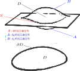

> 场的拉格朗日形式，保持明显的洛伦兹协变性。
>
> 场的哈密顿形式，依赖于时空的1+3分解，因为时间变量在`共轭动量密度`中扮演了特殊的角色。
>
> 有限维Noether定理，条件更松，**每个单参微分同胚群对应一个守恒量**。
>
> 场的Noether定理，有更严格的要求，**每个单参等度规群对应一个守恒流**。   

<!--more-->

## 场的拉格朗日处理

物理上的场$\phi$，是一个时空函数，还可能带有标识其性质的指标。比如：标量场$\psi$，矢量场$\psi^a$，旋量场$\psi^A$，张量场$\psi^{ab}$......  

正如有限维位形$q^\mu$的拉格朗日量

$$
L=L(q^\mu,\dot{q}^\mu)
$$

（无限维）标量场$\phi$场的拉格朗日量

$$
L=\int_S{\mathscr{L}(\phi,\nabla_a\phi)}
$$

其中，$\phi$的定义域是**时空流形**，$\mathscr{L}$是拉格朗日密度，$S$是某时刻**三维位形流形**，对标量场而言$\nabla_a\phi=\partial_a \phi$。

进而可写出作用量

$$
S=\int_{t_0}^{t_1}{L\ dt}=\boxed{\int_D{\mathscr{L}(\phi,\nabla_a\phi)}}=\int_D{\mathscr{L}(\phi,\nabla_a\phi)\boldsymbol{\varepsilon}}
$$

其中，$D$是四维时空位形（如图），由固定的初始三维空间位形$A$和固定的终了三维空间位形$B$围成，$\boldsymbol{\varepsilon}$是时空度规适配体元。

根据**最小作用原理**，可写出标量场的欧拉-拉格朗日方程（以前的笔记推导过，不再复述）：

$$
\boxed{\frac{\partial \mathscr{L}}{\partial \phi}=\nabla_a\frac{\partial \mathscr{L}}{\partial(\nabla_a\phi)}}
$$

考虑两个相差一个四维散度的拉格朗日密度

$$
\mathscr{L}'=\mathscr{L}+\nabla_a K^a
$$

对应的作用量的变分：

$$
\begin{aligned}\delta\int_D{\mathscr{L}'}=&\delta\int_D{\mathscr{L}}+\delta\int_D{\nabla_a K^a}\\ =& \delta\int_D{\mathscr{L}}+\delta\int_D{(\nabla_a K^a) \boldsymbol{\varepsilon}}\quad \textcolor{red}{流形上积分定义}\\ =& \delta\int_D{\mathscr{L}}+\delta\int_{\partial D}{K^a n_a \hat{\boldsymbol{\varepsilon}}}\quad \textcolor{red}{流形上Gauss定理}\\ =& \delta\int_D{\mathscr{L}}\quad \textcolor{red}{固定边界积分的变分为0}\end{aligned}
$$

这意味着：**拉格朗日密度**$\mathscr{L}$相差一个`四维散度` 等价于  **拉格朗日量**$L$相差一个`全导数`。  都对应同一个（场）运动方程。

## 场的哈密顿形式

在哈密顿形式中，也有`共轭动量密度`$\pi$：

$$
\pi=\frac{\partial\mathscr{L}}{\partial \dot{\phi}}
$$

注意：前面拉格朗日形式能保持明显的洛伦兹协变性，但哈密顿形式则缺少这种明显性。因为时间变量在`共轭动量密度`中扮演了特殊的角色。这里已经做了时空的1+3分解：

$$
\boxed{\nabla_\mu=(\nabla_0,\boldsymbol{\nabla})=(\partial/\partial t,\boldsymbol{\nabla})}
$$

于是

$$
\dot{\phi}=\nabla_0\phi=\frac{\partial \phi}{\partial t}
$$

在此基础上定义`哈密顿密度`$\mathscr{H}$

$$
\mathscr{H}(\phi,\pi,\boldsymbol{\nabla}\phi)=\mathscr{\pi}\dot{\phi}-\mathscr{L}
$$

注意：这个哈密顿量也体现了1+3分解

进而作用量的变分为：

$$
\begin{aligned}0=\delta S&=\int_D{\delta \mathscr{L}}=\int_D{\delta (\pi\dot{\phi}-\mathscr{H})}\\ &= \int_D{\left(\textcolor{blue}{\dot{\phi}\delta \pi+\pi\delta \dot{\phi}}\textcolor{green}{-\frac{\partial \mathscr{H}}{\partial\phi}\delta\phi-\frac{\partial \mathscr{H}}{\partial\pi}\delta\pi-\frac{\partial \mathscr{H}}{\partial(\boldsymbol{\nabla}\phi)}\cdot\delta\boldsymbol{\nabla}\phi}\right)}\\ &= \int_D{\left(\dot{\phi}\delta \pi+\textcolor{blue}{\pi\frac{\partial}{\partial t}\delta \phi}-\frac{\partial \mathscr{H}}{\partial\phi}\delta\phi-\frac{\partial \mathscr{H}}{\partial\pi}\delta\pi\textcolor{green}{-\frac{\partial \mathscr{H}}{\partial(\boldsymbol{\nabla}\phi)}\cdot\boldsymbol{\nabla}(\delta\phi)}\right)}\\ &= \int_D\left(\dot{\phi}\delta \pi+\textcolor{blue}{\frac{\partial}{\partial t}(\pi\delta \phi)-\dot{\pi}\delta \phi}-\frac{\partial \mathscr{H}}{\partial\phi}\delta\phi-\frac{\partial \mathscr{H}}{\partial\pi}\delta\pi \right. \\ &\qquad \left.\textcolor{green}{-\boldsymbol{\nabla}\cdot\left(\frac{\partial \mathscr{H}}{\partial(\boldsymbol{\nabla}\phi)}\delta\phi\right) +\left(\boldsymbol{\nabla}\cdot\frac{\partial \mathscr{H}}{\partial(\boldsymbol{\nabla}\phi)}\right)\delta\phi}\right)\\ &= \int_D{\left\{\left(\dot{\phi}-\frac{\partial \mathscr{H}}{\partial\pi}\right)\delta\pi-\left(\dot{\pi}+\frac{\partial \mathscr{H}}{\partial\phi}-\boldsymbol{\nabla}\cdot\frac{\partial \mathscr{H}}{\partial(\boldsymbol{\nabla}\phi)}\right)\delta\phi\right\}}\\ &\qquad \qquad +\int_D{\frac{\partial}{\partial t}(\pi\delta \phi)}-\int_D{\boldsymbol{\nabla}\cdot\left(\frac{\partial \mathscr{H}}{\partial(\boldsymbol{\nabla}\phi)}\delta\phi\right)}\quad \textcolor{red}{边界上变分为0} \\ &= \boxed{\int_D{\left\{\left(\dot{\phi}-\frac{\partial \mathscr{H}}{\partial\pi}\right)\delta\pi-\left(\dot{\pi}+\frac{\partial \mathscr{H}}{\partial\phi}-\boldsymbol{\nabla}\cdot\frac{\partial \mathscr{H}}{\partial(\boldsymbol{\nabla}\phi)}\right)\delta\phi\right\}}} \end{aligned}
$$

进而有

$$
\begin{aligned}\dot{\phi}&=\frac{\partial \mathscr{H}}{\partial\pi}\\ \dot{\pi}&=-\frac{\partial \mathscr{H}}{\partial\phi}+\boldsymbol{\nabla}\cdot\frac{\partial \mathscr{H}}{\partial(\boldsymbol{\nabla}\phi)}\end{aligned}
$$

## 场上的Noether定理

(有限维)`Noether定理`：每一个保持`拉格朗日量`不变的单参微分同胚群（对称性），必有运动方程组对应的一个首次积分（守恒律）。

这个定理，在有限维的情况下证明过。 这里要考察无限维的张量场$\phi$下的情况，命题中的拉格朗日量改成`拉格朗日密度`，所谓"不变"，可以精确到相差一个四维散度。

考察一个单参微分同胚$h:\mathbb{R}\times D\to D$，条件是保证`拉格朗日密度`$\mathscr{L}$不变，即：

$$
\mathscr{L}(h^*_s\phi,h^*_s\nabla_a\phi)=\mathscr{L}(\phi,\nabla_a\phi),\quad s\to0,\quad \forall s\in \mathbb{R}
$$

其中，$h_s$对标量场和对偶矢量场的自然诱导映射是拉回映射$h^*_s$；$\nabla_a$是度规适配导数算符；此外，单参微分同胚群$\{h_s\}$，可由某个矢量场$\xi^a$生成。

要注意的是，单参微分同胚不一定保度规，所以变换后度规可能会变，进而其适配导数算符也会变。为了准确描述这个变化，需要将`拉格朗日密度`改写成：

$$
\mathscr{L}=\mathscr{L}(\phi,\nabla_a\phi,g_{ab})
$$

用$h_s$变换后

$$
\mathscr{L}_s=\mathscr{L}(h^*_s\phi,h^*_s\nabla_a\phi,h^*_s g_{ab})=h^*_s \mathscr{L}(\phi,\nabla_a\phi,g_{ab})
$$

进而

$$
\begin{aligned}\xi^a\nabla_a\mathscr{L}&=\mathcal{L}_\xi\mathscr{L}=\left.\frac{d\mathscr{L}_s}{ds}\right|_{s=0}\qquad \textcolor{red}{\mathcal{L}_\xi 表示李导数}\\&=\lim_{s\to 0}\left(\frac{1}{s}(\mathscr{L}(h^*_s\phi,h^*_s\nabla_a\phi,h^*_s g_{ab})-\mathscr{L}(\phi,\nabla_a\phi,g_{ab}))\right)\\ &=\frac{\partial \mathscr{L}}{\partial \phi} \lim_{s\to 0}\left(\frac{1}{s}(h^*_s\phi-\phi)\right)\\ &\qquad +\frac{\partial \mathscr{L}}{\partial (\nabla_a\phi)} \lim_{s\to 0}\left(\frac{1}{s}(h^*_s\nabla_a\phi-\nabla_a\phi)\right)\\ & \qquad + \frac{\partial \mathscr{L}}{\partial (g_{ab})} \lim_{s\to 0}\left(\frac{1}{s}(h^*_s g_{ab}-g_{ab})\right)\\ &=\boxed{\frac{\partial \mathscr{L}}{\partial \phi}\mathcal{L}_{\xi}\phi +\frac{\partial \mathscr{L}}{\partial (\nabla_a\phi)} \mathcal{L}_{\xi}\nabla_a\phi + \frac{\partial \mathscr{L}}{\partial (g_{ab})}\mathcal{L}_{\xi}g_{ab}}\end{aligned}
$$

将拉格朗日方程带入得

$$
\xi^a\nabla_a\mathscr{L}=\left(\nabla_a\frac{\partial \mathscr{L}}{\partial(\nabla_a\phi)}\right)\mathcal{L}_{\xi}\phi +\frac{\partial \mathscr{L}}{\partial (\nabla_a\phi)} \mathcal{L}_{\xi}\nabla_a\phi + \frac{\partial \mathscr{L}}{\partial (g_{ab})}\mathcal{L}_{\xi}g_{ab}
$$

特别地，如果$h_s$是**等度规映射**，那么$\xi^a$必然是Killing矢量场，有:

$$
\mathcal{L}_\xi g_{ab}=0\\ \nabla_a\xi^a=g^{ab}\nabla_a\xi_b=g^{(ab)}\nabla_{[a}\xi_{b]}=0\\ \nabla_a\mathcal{L}_\xi\phi=\mathcal{L}_\xi\nabla_a\phi
$$

于是有：

$$
\nabla_a\left(\frac{\partial \mathscr{L}}{\partial(\nabla_a\phi)}\mathcal{L}_{\xi}\phi-\xi^a\mathscr{L}\right)=0
$$

可见矢量场

$$
\boxed{J^a=\frac{\partial \mathscr{L}}{\partial(\nabla_a\phi)}\mathcal{L}_{\xi}\phi-\xi^a\mathscr{L}}
$$

满足连续性方程：

$$
\boxed{\nabla_a J^a=0}
$$

进而$J^a$代表某种`守恒流密度`。

(场)`Noether定理`：每一个保持`拉格朗日密度`不变的单参等度规群（对称性），必有场方程对应的一个连续性（守恒律）。

特别地，对闵氏时空而言，存在10个独立Killing矢量场$\xi^a$，相应就有10个独立守恒密度流$J^a$。

比如，考虑时间平移Killing矢量场$\xi^a=(\partial/\partial t)^a$，有

$$
J^a=\frac{\partial \mathscr{L}}{\partial(\nabla_a\phi)}(\partial/ \partial t)^b\nabla_b\phi-(\partial/ \partial t)^a\mathscr{L}=\frac{\partial \mathscr{L}}{\partial(\nabla_a\phi)}\nabla_0\phi-(\partial/\partial t)^a\mathscr{L}
$$

因此

$$
J^0=\frac{\partial \mathscr{L}}{\partial(\nabla_0\phi)}\nabla_0\phi-\mathscr{L}=\mathscr{\pi}\dot{\phi}-\mathscr{L}=\mathscr{H}
$$

此外，还可以定义一个`正则能动张量`$S^{ab}$：

$$
\boxed{S^{ab}\overset{\Delta}{=}-\frac{\partial \mathscr{L}}{\partial(\nabla_a\phi)}\nabla^b\phi+\mathscr{L}g^{ab}}
$$

则有：

$$
\boxed{S^{ab}\xi_b=-J^a \qquad \nabla_a S^{ab}=0 }
$$

注意：$\xi^a$必须是Killing矢量场，上式才成立。

