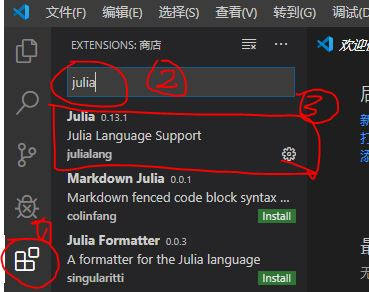

## 目标

1）利用静态网站生成器Hugo建立我的文档站；

2）利用码云进行文档同步，并且也作为静态文档发布站；

3）利用Typora进行文档编辑，利用git利用进行文档同步；

4）确保能完美支持数学公式。

<!--more-->

## 第一步：安装git

我选择的是[官方winGUI版本](https://git-scm.com/)，国内很难下载，建议翻墙下载。默认选项安装即可。

由于官方版本本来就支持shell，后面的操作主要是在git bash下进行，如果GUI更方便时就使用GUI。

## 第二步：安装Hugo

选择Hugo的原因，是因为配置简单、库依赖度很低。

依然选择[官方win版本](https://github.com/gohugoio/hugo/releases)，翻墙下载。

我选择的是`hugo_extended_0.64.1_Windows-64bit.zip`，解压，设置好PATH就能用。

## 第三步：在码云上创建一个初始库

选择[码云](https://gitee.com/)而不是GitHub的原因是众所周知，虽然可以翻墙，毕竟麻烦。

创建一个初始库即可，不用额外设置。

我所创建的库是：[https://gitee.com/chaoskey/notes](https://gitee.com/chaoskey/notes)

## 第三步：建立初始站点

打开git bash，后同。

```shell
# 初始化本地站点
hugo new site notes
cd notes
```

打开git GUI, 将`https://gitee.com/chaoskey/notes`克隆到刚构建本地目录`notes`。 如果克隆时提示已存在，则先备份notes，克隆后再覆盖回去。


先设置站点根目录  https://chaoskey.gitee.io/notes/

## 第四步：选择主题

我的目标时文档站，所以我找到一款简洁并适合自己的一个主题`hugo-book`：

```shell
# 克隆主题到themes/book
git clone https://github.com/alex-shpak/hugo-book themes/book

# 复制主题范例站点和配置
cp -a themes/book/exampleSite/config.toml .
cp -a themes/book/exampleSite/content .
```

## 第五步：公式引擎配置(可选)

由于该主题已经支持`katex`，所以此步可选。 但默认只支持`latex`格式，所以我作了后面的改动，以支持```$$\latex$$```的格式，并且还通过配置支持`katex`和`mathjax`。

在`themes\book\layouts\partials\docs\inject\footer.html`中添加代码 [点击这里查看](/notes/assets/footer) ，支持`katex`和`mathjax` （如果您是其它的主题，你可以找到类似`footer.html`的html模板自行添加）。

然后把`themes\book\layouts\shortcodes\katex.html`前面部分的引用全部删除。

在`config.toml`中添加一段配置，默认使用`katex`引擎

```latex
  #######################################
  # (Optional, default none) 选择数学公式渲染引擎
  # 默认就是katex引擎,  另外的选择就是 mathjax引擎 (即使改了引擎，标签也继续沿用katex)
  # 优先使用$$作为公式界定符号
  #  1. 内联公式，比如： $$a^2$$
  #  2. 块公式，比如：
  #     $$
  #     a^2
  #     $$
  # 如果渲染失败时（hugo和引擎的冲突），首先作如下2个置换 
  #  1. 内联公式:\$\$(.*?\\[\\\}\{].*?)\$\$ => $1
  #  2. 块公式:\$\$(\n.*?\\[\\\}\{].*?\n)\$\$ => $1
  # 如果还是失败，则修改公式。
  #######################################
  # katex = "mathjax"
```


## 第六步：图片位置规划

图片我统一放在`content\images`中，然后采用相对路径引用,比如：

```latex
  
```

## 第七步：Typora和Hugo站点协调

由于Hugo的Markdown解析机制和```$$```格式下的公式又是存在冲突存在，导致能再Typora显示正常的公式，在Hugo解析Markdown时会错误显示或步显示公式。

为了解决这个问题，我写了两个shell脚本(`fortypora`和`forgitee`)。

写文章时，先执行:

```shell
# 将`latex`
# 转换成$$格式
./fortypora
```

站点预览或站点发布时，执行:

```shell
# 先将`$$`
# 转换成`latex`
# 再执行 hugo [servere] -D 命令
# ./forgitee       # 站点发布（生成静态文件）
./forgitee server  # 站点预览

```

`fortypora`的内容 [点击这里查看](/notes/assets/fortypora)。


`forgitee`中的内容 [点击这里查看](/notes/assets/forgitee)。


## 日常操作

1）用`typora`写文章

```shell
# 写文章前确保执行过下面的命令
./fortypora

# 构建新文章模板
hugo new docs/my-first-post.md 
```

2）预览站点 生成静态文件

```shell
# 站点预览
./forgitee server  

# 站点发布（生成静态文件）
./forgitee       
```

3）用`git`提交站点（包括站点源码和静态文件）

