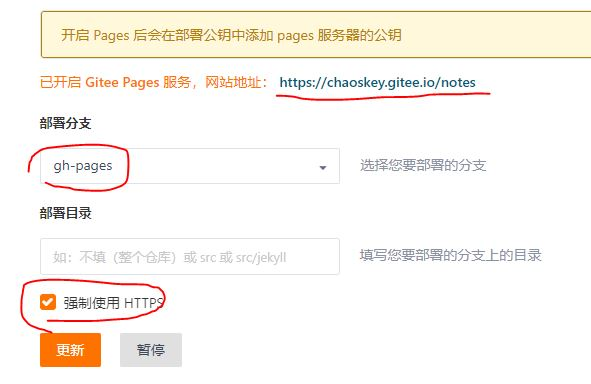

## 目标(配置好后的日常操作)

> 更新流程简单舒服，页面主题简洁，完全支持Markdown+LaTeX。

1）**本地撰写**内容：用[Typora](https://www.typora.io/)写基于Markdown+LaTeX的内容。

2）利用静态网站生成器Hugo生成待发布的静态文件： 执行`./forgitee`。

- 这个脚本实际依次执行了：1. 对所有md文件进行部分内容替换，确保站点可以完全解析；2. 执行`hugo -D`,生成待发布的静态文件，生成文件夹`public`; 3. 执行`fortypora`对所有md文件进行逆向置换复原，确保Typora打开能完全显示正常。

3） 将站点**git提交**到[码云（gitee）](https://gitee.com)： https://gitee.com/chaoskey/notes 

- 包括站点全部源码（相当于文档云同步）和生成的静态文件目录`public`。

4） 部署到： https://chaoskey.gitee.io/notes



<!--more-->

------

## 第一步：安装git

我选择的是[官方winGUI版本](https://git-scm.com/)，国内很难下载，建议翻墙下载。默认选项安装即可。

由于官方版本本来就支持shell，后面的操作主要是在git bash下进行，如果GUI更方便时就使用GUI。

## 第二步：安装Hugo

选择Hugo的原因，是因为配置简单、库依赖度很低。

依然选择[官方win版本](https://github.com/gohugoio/hugo/releases)，翻墙下载。

我选择的是`hugo_extended_0.64.1_Windows-64bit.zip`，解压，设置好PATH就能用。

## 第三步：在码云上创建一个初始库

选择[码云](https://gitee.com/)而不是GitHub的原因是众所周知，虽然可以翻墙，毕竟麻烦。

创建一个初始库即可，不用额外设置。

我所创建的库是：[https://gitee.com/chaoskey/notes](https://gitee.com/chaoskey/notes)

## 第四步：建立初始站点

打开git bash，后同。

```shell
# 初始化本地站点
hugo new site notes
cd notes
```

打开git GUI, 将`https://gitee.com/chaoskey/notes`克隆到刚构建本地目录`notes`。 如果克隆时提示已存在，则先备份notes，克隆后再覆盖回去。


先设置站点根目录  https://chaoskey.gitee.io/notes/

## 第五步：选择主题

我的目标是学习笔记，所以我找到一款简洁并适合的主题`hugo-book`：

```shell
# 克隆主题到themes/book
git clone https://github.com/alex-shpak/hugo-book themes/book

# 复制主题范例站点和配置
cp -a themes/book/exampleSite/config.toml .
cp -a themes/book/exampleSite/content .
```

## 第六步：公式引擎配置(可选)

由于该主题已经支持`katex`,所以此步可选，对应的代码位置： 

`themes\book\layouts\shortcodes\katex.html`

但原版默认只支持`latex`格式，所以我作了后面的改动，以支持```$$\latex$$```的格式，并且还通过配置支持`katex`和`mathjax`。

```html
<!--
原始位置：
	themes\book\layouts\shortcodes\katex.html
也可以将其独立出来放在站点根目录下：
	layouts\shortcodes\katex.html
-->
{{ if not (.Page.Scratch.Get "katex") }}
  {{ if and (isset .Site.Params "katex") (eq .Site.Params "mathjax" ) }} 
    <!-- Include mathjax only first time -->
    <script type="text/x-mathjax-config">
      MathJax.Hub.Config({
          showProcessingMessages: false,
          messageStyle: "none",
          extensions: ["tex2jax.js"],
          jax: ["input/TeX", "output/HTML-CSS"],
          tex2jax: {
              inlineMath:  [ ["$$", "$$"], ["\(", "\)"] ],
              displayMath: [ ["$$\n","\n$$"], ["\\[","\\]"] ],
              skipTags: ['script', 'noscript', 'style', 'textarea', 'pre','code','a'],
              ignoreClass:"comment-content"
          },
          "HTML-CSS": {
              availableFonts: ["STIX","TeX"],
              showMathMenu: false
          }
      });
      MathJax.Hub.Queue(["Typeset",MathJax.Hub]);
    </script>
    <script src="https://cdn.bootcss.com/mathjax/2.7.6/MathJax.js?config=TeX-AMS-MML_HTMLorMML"></script>
  {{ else }}
    <!-- Include katext only first time -->
    <link rel="stylesheet" href="https://cdn.bootcss.com/KaTeX/0.11.1/katex.min.css" integrity="sha384-zB1R0rpPzHqg7Kpt0Aljp8JPLqbXI3bhnPWROx27a9N0Ll6ZP/+DiW/UqRcLbRjq" crossorigin="anonymous">
    <script defer src="https://cdn.bootcss.com/KaTeX/0.11.1/katex.min.js" integrity="sha384-y23I5Q6l+B6vatafAwxRu/0oK/79VlbSz7Q9aiSZUvyWYIYsd+qj+o24G5ZU2zJz" crossorigin="anonymous"></script>
    <script defer src="https://cdn.bootcss.com/KaTeX/0.11.1/contrib/auto-render.min.js" integrity="sha384-kWPLUVMOks5AQFrykwIup5lo0m3iMkkHrD0uJ4H5cjeGihAutqP0yW0J6dpFiVkI" crossorigin="anonymous"
            onload="renderMathInElement(document.body,
                {delimiters: [{left: '$$\n', right: '\n$$', display: true}, {left: '$$', right: '$$', display: false}, 
                              {left: '\\[', right: '\\]', display: true}, {left: '\\(', right: '\\)', display: false}]});"></script>
  {{ end }}
{{ .Page.Scratch.Set "katex" true }}
{{ end }}


<span class="katex{{ with .Get "class" }} {{ . }}{{ end }}">
  {{ if in .Params "display" }}\[{{ else }}\({{ end -}}
  {{ $.Inner }}
  {{- if in .Params "display" }}\]{{ else }}\){{ end }}
</span>

```

然后，在`config.toml`中添加一段配置，默认使用`katex`引擎

```latex
  #######################################
  # (Optional, default none) 选择数学公式渲染引擎
  # 默认就是katex引擎,  另外的选择就是 mathjax引擎 (即使改了引擎，标签也继续沿用katex)
  # 优先使用$$作为公式界定符号
  #  1. 内联公式，比如： $$a^2$$
  #  2. 块公式，比如：
  #     $$
  #     a^2
  #     $$
  # 如果渲染失败时（hugo和引擎的冲突），首先作如下2个置换 
  #  1. 内联公式:\$\$(.*?\\[\\\}\{].*?)\$\$ => $1
  #  2. 块公式:\$\$(\n.*?\\[\\\}\{].*?\n)\$\$ => $1
  # 如果还是失败，则修改公式。
  #######################################
  # katex = "mathjax"
```

## 第七步：Typora和Hugo站点协调

由于Hugo的Markdown解析机制和```$$```格式下的公式有时存在冲突，导致在Typora显示正常的公式，在Hugo解析Markdown时会错误显示或不显示公式。

为了解决这个问题，我写了两个shell脚本：

1） `./fortypora`：   执行后确保用Typora打开本地md文件可以正常渲染，特别是数学公式。

```bash
#!/bin/bash

# 执行后确保用Typora打开本地md文件可以正常渲染，特别是数学公式。
# 将`latex`
# 转换成$$格式
# ./fortypora

# md文件递归
function action(){
    for file in `ls $1` 
    do
        if [ -d $1"/"$file ] 
        then
            action $1"/"$file
        elif [ "${file#*.}"x = "md"x ]
        then
            # 方便用typora阅读
            sed -i 's//$$/g; s//$$/g; s//$$/g; s/!\[.*\](\.\.\/\.\.\/images\//{
    for file in `ls $1` 
    do
        if [ -d $1"/"$file ] 
        then
            action $1"/"$file
        elif [ "${file#*.}"x = "md"x ]
        then
            # 方便发布到gitee
            sed -i '/```/ { :begin1; /```.*```/! { $! { N; b begin1 }; }; n; }; /\$\$/ { :begin2; /\$\$[^$]*\$\$/! { $! { N; b begin2 }; }; }; s/\$\$\(\n[^$]*\n\)\$\$/\1/g; s/\$\$\([^$]*\)\$\$/\1/g; s/!\[.*\](\.\.\/images\//![](..\/..\/images\//g;'  $1"/"$file
        fi
    done
} 

action ./content

if [ "$1"x = "server"x ] 
then
    # 本地预览
    hugo server --disableFastRender -D
else
    rm -rf public 
    # 生成待发布的静态文件，生成的目录 public
    hugo -D
    # 方便用typora阅读
    ./fortypora
fi

```


